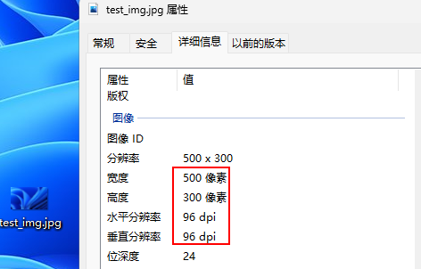
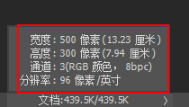
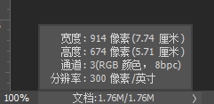
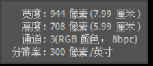

## 前置知识

在理清分辨率、像素和尺寸大小的关系之前，需要先搞清楚一组单位换算关系：


$$
1英寸\mathrm{(inch)}= 2.54厘米\mathrm{(cm)}
$$
在补充一个小知识点（本文用不到）：
$$
1寸 = 3.3333厘米\mathrm{(cm)}
$$

## 正文

### 计算公式

像素（pixel）、分辨率（DPI）、尺寸（inch）三者计算公式如下：
$$
尺寸\mathrm{（inch）}=\frac{\mathrm{像素（pixel）}}{分辨率\mathrm{（DPI）}}
$$

### 名词解释

+ **尺寸(inch)：**就是我们实际看到的大小，也称打印尺寸。

+ **分辨率（DPI）**：英文Dots  Per Inch，即每英寸点数，是一个量度单位，用于点阵数字图像，指每一[英寸](https://zh.wikipedia.org/wiki/英吋)长度中，取样或可显示或输出点的数目。

  > 如：打印机输出可达300DPI的分辨率，表示打印机可以在每一平方英寸的面积中可以输出300X300＝90000个输出点。

## 案例

如下一张图片，可以查看其属性参数：



然后，用ps打开该图片，查看尺寸大小：



计算方式如下：
$$
\mathrm{W}=& \frac{500}{96}\times2.54=13.23厘米\\
\mathrm{H}=& \frac{300}{96}\times2.54=7.94厘米
$$

## Matplotlib中的应用

### case 1:

```python
import matplotlib.pyplot as plt

x = [97.66, 96.78, 93.32, 78.47, 80.64]
y = [0.31, 0.78, 1.63, 0.64, 1.52]

# 图片需要满足如下要求：w=8cm, h=6cm, dpi=300
plt.figure(figsize=(8/2.54,  6/2.54), dpi=300)
plt.plot(x, y)

plt.savefig(r'.\test.jpg', dpi=300, bbox_inches='tight')
```

注意到添加了`bbox_inches='tight'`之后，尺寸会有一定的变换：



### case 2:

```python
import matplotlib.pyplot as plt

x = [97.66, 96.78, 93.32, 78.47, 80.64]
y = [0.31, 0.78, 1.63, 0.64, 1.52]

# 图片需要满足如下要求：w=8cm, h=6cm, dpi=300
plt.figure(figsize=(8/2.54,  6/2.54), dpi=300)
plt.plot(x, y)

plt.savefig(r'.\test.jpg', dpi=300)
```

**去掉`bbox_inches='tight'`之后，尺寸与预设的一样：**



## 参考文献

[每英寸点数 - 维基百科，自由的百科全书 (wikipedia.org)](https://zh.wikipedia.org/wiki/每英寸点数)