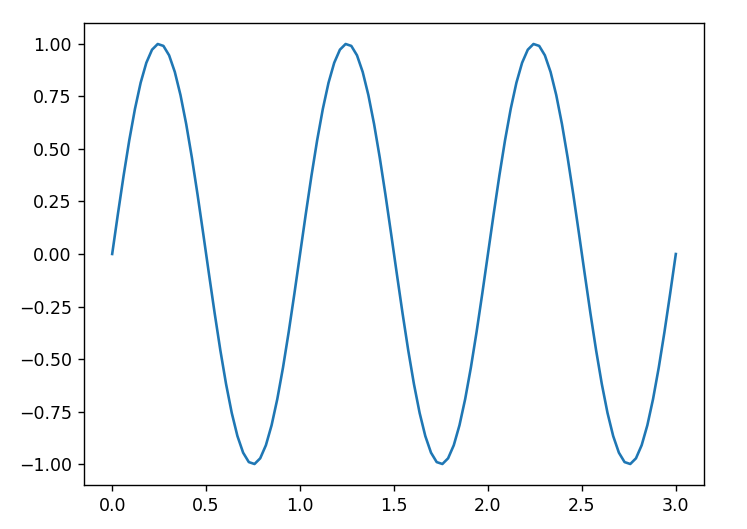
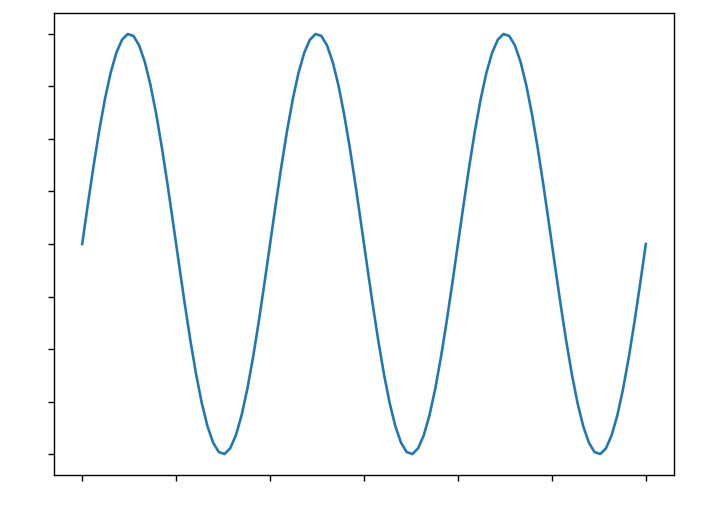
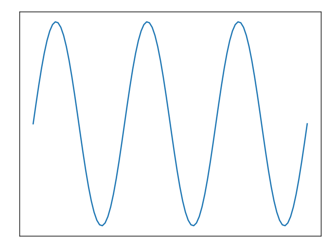

**原图**

```python
x = np.linspace(0, 3, 100)
y = np.sin(2*np.pi*x)

fig, ax = plt.subplots()
ax.plot(x, y)
plt.show()
```

<div align='center'>
    
</div>

**仅隐藏刻度值**

```python
x = np.linspace(0, 3, 100)
y = np.sin(2*np.pi*x)

fig, ax = plt.subplots()
ax.plot(x, y)

# 隐藏刻度值
ax.xaxis.set_major_formatter(plt.NullFormatter())
ax.yaxis.set_major_formatter(plt.NullFormatter())

plt.show()
```

<div align='center'>
    
</div>

**隐藏刻度线+刻度值**

```python
x = np.linspace(0, 3, 100)
y = np.sin(2*np.pi*x)

fig, ax = plt.subplots()
ax.plot(x, y)

# 同时隐藏tick_line和tick_value
ax.yaxis.set_major_locator(plt.NullLocator())
ax.xaxis.set_major_locator(plt.NullLocator())

plt.show()
```

<div align='center'>
    
</div>


**参考：**https://www.zhihu.com/question/506717024/answer/2654103319

