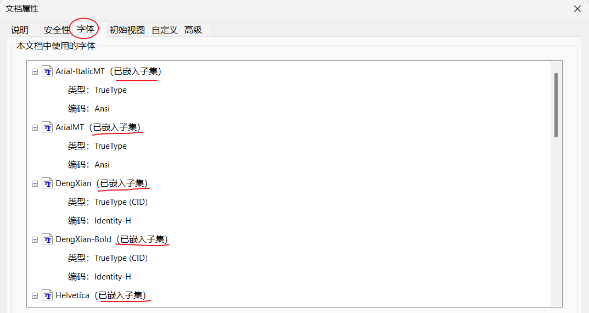
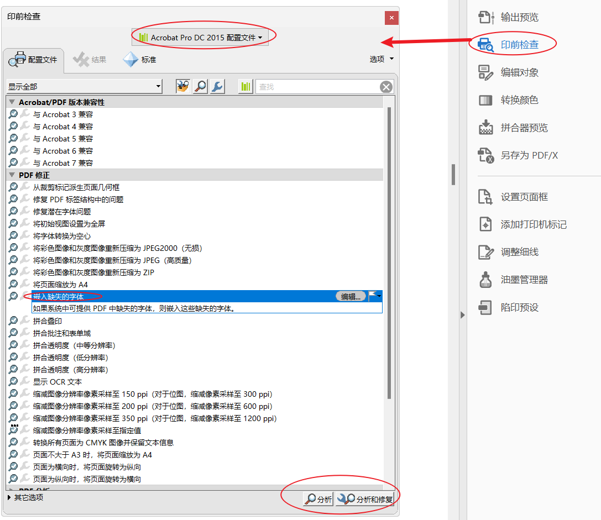
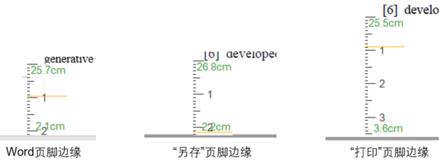
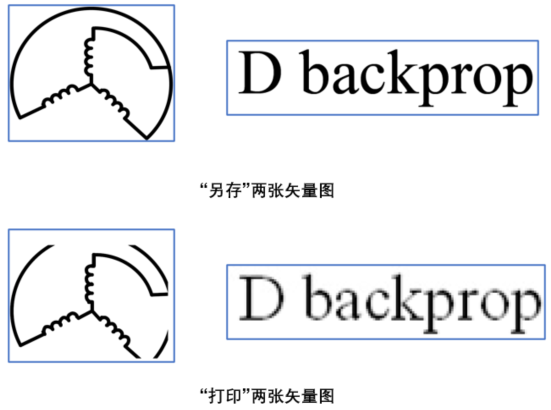

在系统上提交论文时候一般要求PDF文档，但是word直接转PDF可能存在一些问题：

* 部分图片不清晰。
* 字体未嵌入PDF。
* 间距发生了变化。
* 字体发生了变化。

* 一张图片显示不完全。

# 结论

**1. 另存PDF**

推荐使用word直接另存为PDF，然后在adobe PDF软件里面检查字体是否嵌入。如果部分字体没有嵌入，直接在adobe PDF里面进行嵌入。

**2. 检查字体是否嵌入**

用adobe PDF打开pdf文档，点击*文件*—*属性*—*字体*，查看字体是否全部嵌入。如果有的字体上面没有显示”已嵌入子集“，表明嵌入失败了，需要重新嵌入。

    

**3. 嵌入字体**

点击*工具*—*印刷制作*—*印前检查*—*PDF修正*—*分析和修复*，完成之后，再次检查是否嵌入了缺失的字体。

**注意：：**有的软件上可能没有”PDF修正“这一项，此时需要切换adobe的配置，设置为”DC 2015配置文件“。

    

# 分析

word转PDF可以分为四种，即*另存为*，*另存为adobe PDF*，*打印adobe PDF*，*打印microsoft PDF*。

    

经过实验发现（测量word上最后一行文字与底边之间的距离），**“另存”**这种方法基本不会改变原文档的页边距大小，**“打印”**会改变页边距：

    

其次，采用**“打印”**的方式出现了两个问题，有几张矢量图变模糊了，还有张矢量图没显示全面：

    

# 参考

[1] [pdf嵌入字体（不用adobe pdf打印机）-CSDN博客](https://blog.csdn.net/benchuspx/article/details/120070051)

[2] [visio导出PDF图，解决字母间距问题、线条变粗问题、PDF图去除白边问题 - Picassooo - 博客园 (cnblogs.com)](https://www.cnblogs.com/picassooo/p/16379747.html)
