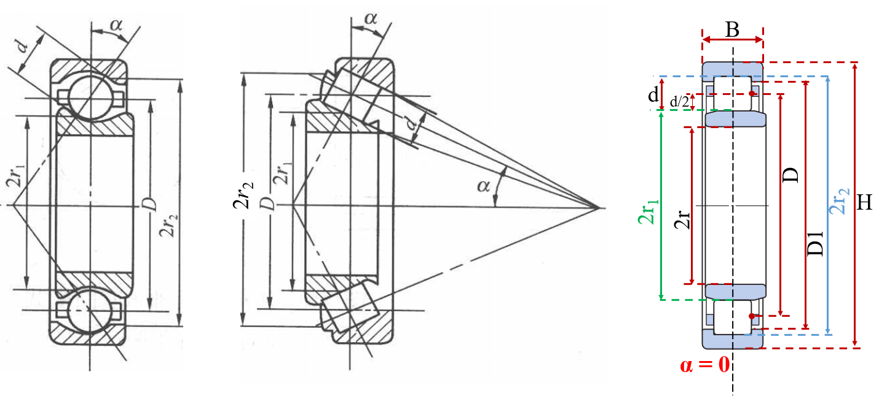
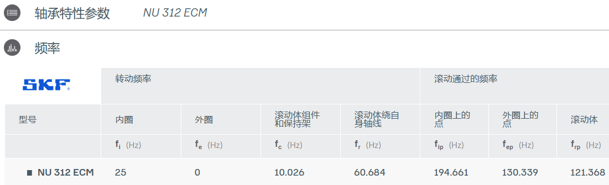

# 1. 轴承结构参数

下图给出了常见轴承的结构参数。需要注意是，图中的命名符号以及标注仅做直观认识，不作为标准规范指导。

<div align='center'>
    
</div>

**符号说明：**

+ $d$：滚子直径
+ $d/2$：滚子半径
+ $\alpha$：接触角 (°)
+ $2r_1$：内滚道直径
+ $D$：轴承节径（滚动体中心所在的圆的直径）
+ $2r_2$：外滚道直径
+ $2r$：内径（孔径）
+ $D_1$：外圈挡边直径
+ $H$：外径
+ $B$：轴承宽度
+ $Z$：滚珠个数

**节径$D$计算公式：**

$$
D=\frac{2r_1+2r_2}{2}=2r_1+d
$$

# 2. 轴承特征频率计算
**（1）内圈转频$f_r$**

假定外圈固定，内圈旋转，其中$N$是转轴的转速，单位r/min，则内圈的转频计算公式如下：
$$
f_r=\frac{N}{60}
$$

**（2）内圈故障特征频率$f_i$**

$Z$个滚动体在内圈上的某一个固定点的通过频率：

$$
f_i=\frac{Z}{2}(1+\frac{d}{D}\cos\alpha) f_r
$$

**（3）外圈故障特征频率$f_o$**

$Z$个滚动体在外圈上的某一个固定点的通过频率：

$$
f_o=\frac{Z}{2}(1 - \frac{d}{D}\cos\alpha) f_r
$$

**（4）滚动体故障特征频率$f_b$**

滚动体上的某一固定点在内圈或外圈或保持架通过频率（或滚动体自传频率）：

$$
f_b=\frac{D}{2d}[1 - (\frac{d}{D})^2\cos^2\alpha] f_r
$$

**（5）保持架故障特征频率$f_c$**

保持架的旋转频率（或滚动体的公转频率）：

$$
f_c=\frac{1}{2}(1 - \frac{d}{D}\cos\alpha) f_r
$$

以上，$d$滚子直径，$D$节径，$\alpha$接触角，$Z$滚子的个数，$f_r$转轴的转频（内圈转频）。

# 3. 案例

以SKF NU 312 ECM圆柱滚子轴承为例，转速为1500rpm，结构如下：

<div align='center'>
    
</div>

在三维模型中测得的几个重要参数如下：

| 滚子个数$Z$ | 滚子直径$d$ | 内滚道直径 | 外滚道直径 | 节径$D$ | 接触角$\alpha$ |
| ----------- | ----------- | ---------- | ---------- | ------- | -------------- |
| 13          | 19          | 77         | 115        | 96      | 0              |

**计算代码：**

```python
import numpy as np

def bearing_freq(z=13, d=19, D=46.4, alpha=0, n=2500):
    """
    计算滚动轴承的故障特征频率
    :param z: The number of roller element, integer  (滚子个数)
    :param d: roller element diameter, float(mm)     (滚子直径)
    :param D: pitch diameter of bearing, float(mm)   (节径)
    :param alpha: contact angle, float(°)            (接触角)
    :param n: rotational speed, float(r/min)         (转轴的转速)
    eg：
        西储大学轴承参数：z=9, d=7.9400, D=39.0398, alpha=0, n=1797
    """

    # 内圈转频
    fr = n / 60
    # 内圈通过频率(内圈故障特征频率)
    fi = z*(1/2)*(1+d/D*np.math.cos(alpha)) * fr
    # 外圈通过频率(外圈圈故障特征频率)
    fo = z*(1/2)*(1-(d/D)*np.math.cos(alpha)) * fr
    # 滚动体自传频率（滚动体绕自身轴线转动）
    fba = D*(1/(2*d))*(1-np.square(d/D*np.math.cos(alpha))) * fr
    # 滚动体上的某一固定点在内圈或外圈或保持架通过频率（滚动体故障特征频率）
    fb = 2 * fba
    # 保持架旋转频率（保持架故障特征频率）
    fc = (1/2)*(1-(d/D)*np.math.cos(alpha)) * fr
    # 滚动体公转频率
    fbr = fc

    return fr, fc, fba, fbr, fi, fo, fb

if __name__ == "__main__":
    fr, fc, fba, fbr, fi, fo, fb = bearing_freq(z=13, d=19, D=48*2, alpha=0, n=1500)
    print('内圈转频fr: %.2f' % fr)
    print('内圈故障特征(通过)频率fi: %.2f' % fi)
    print('外圈故障特征(通过)频率fo: %.2f'%  fo)
    print('滚动体故障特征(通过)频率fb (fb=2*fba): %.2f' %  fb)
    print('保持架故障特征(转动)频率fc: %.2f' %  fc, '\n')
    print('滚动体公转频率fbr: %.2f' % fbr)
    print('滚动体自传频率fba: %.2f' % fba)
```

**结果：**

```
内圈转频fr: 25.00
内圈故障特征(通过)频率fi: 194.66
外圈故障特征(通过)频率fo: 130.34
滚动体故障特征(通过)频率fb (fb=2*fba): 121.37
保持架故障特征(转动)频率fc: 10.03 

滚动体公转频率fbr: 10.03
滚动体自传频率fba: 60.68
```

**核对：**

<div align='center'>
    
</div>


# 参考

[1] 《滚动轴承故障诊断实用技术》，杨国安.

[2] SKF NU 312 ECM - 圆柱滚子轴承.
