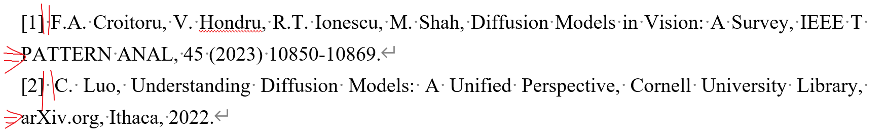
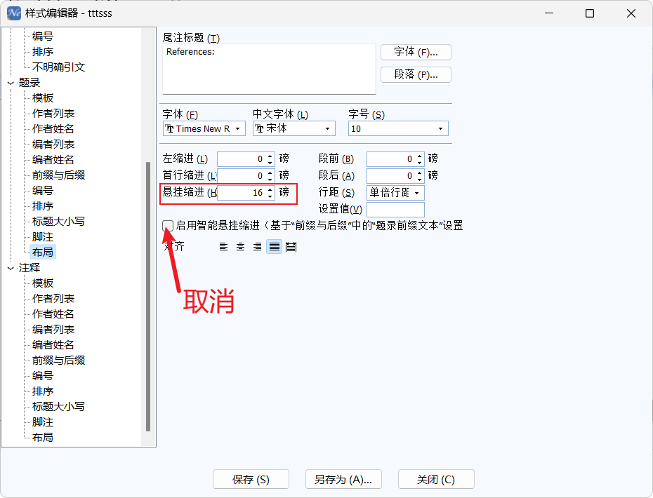
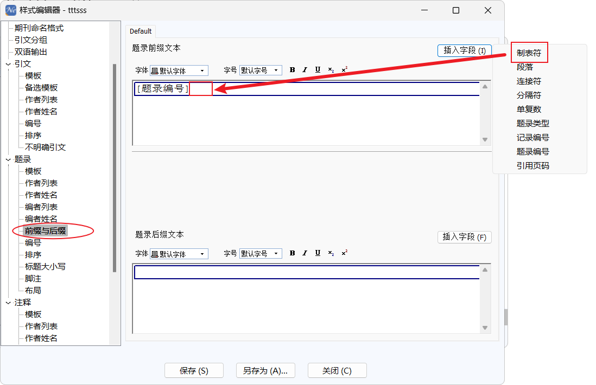

**问题：**

有时候noteexpress插入参考文献的序号与文字之间的**间距过大或者过小**，或者**没有对齐**。

    

**解决办法：**

首先推荐如下的修改方法，

    

下面这种通过**在编号与文字之间插入制表符**，有时候格式不行，会导致间距特别大。因此，建议使用上面的方法。

    

**参考：**

[1] [Noteexpress参考文献编号间隔调整_哔哩哔哩_bilibili](https://www.bilibili.com/video/BV1bY4y1W73V/?vd_source=9846a548f75285e1389fa28ee637d374)

