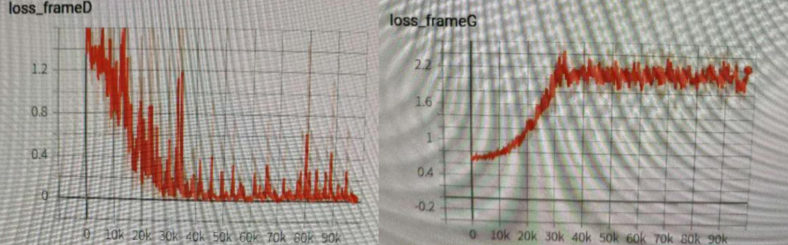
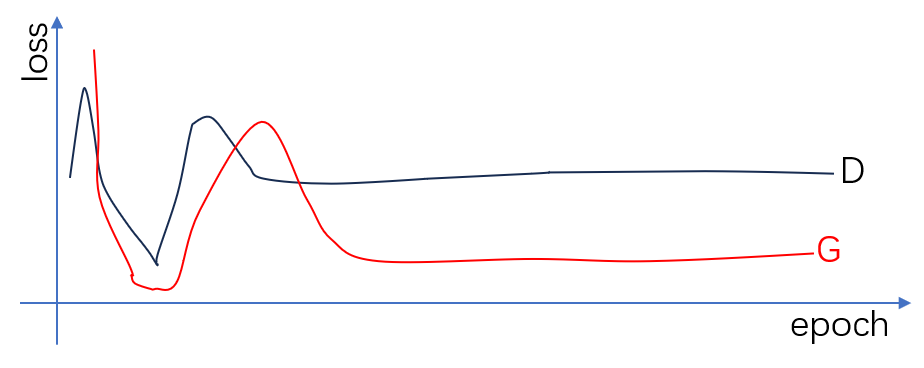
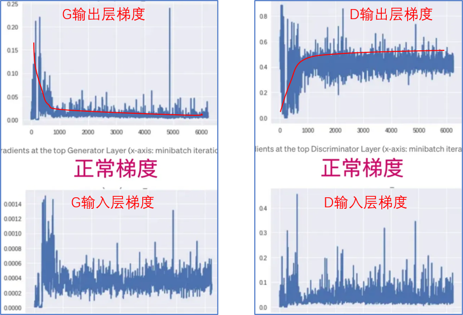
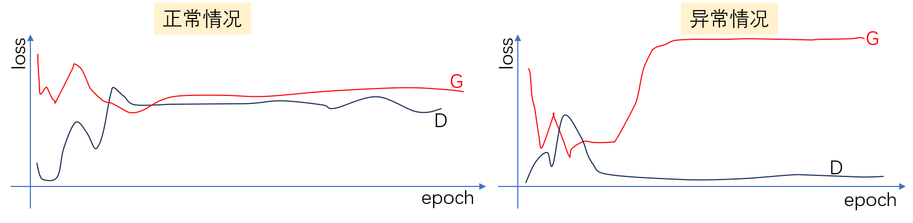

说点什么吧，貌似是被GAN略过千万遍，以后上手其他模型估计是洒洒水啦。从整体而言，GAN有两难，其一是对抗训练在代码实现上相对单一模型和损失函数而言更加复杂，其二是训练过程难以监测，很难从损失曲线上直观的看出训练的效果。

关于GAN的炼丹科学指南，我想可以用如下这句话总结吧。
>我亦无他，惟手熟尔。

# GAN训练问题汇总#

## D太强，loss下降很快， G上升

<div align='center'>
    
</div>

+ 提升G的学习了，降低D的学习率

+ 多训练几次G，训练一次D

+ **loss阈值控制策略**：d_loss小于某个阈值，则不进行step（或者g_loss小于某个阈值，不进行step），如下案例

  ```python
  if d_loss.item() > 0.1:
      optimizer_d.step()
      
  # 或者
  if g_loss.item() > 0.2:
      optimizer_g.step()
  ```


## G太强，D变弱，两者难以收敛

<div align='center'>
    
</div>


# GAN训练技巧汇总#

* 不建议修改n_critic的值，没啥用，时间拉长了，该出现的问题还是会出现
* 监控生成器和判别器的梯度信息。一般而言，在训练初期生成器的梯度较大，因为它要获得新的图片，所以需要较大的梯度，后期梯度就较小。判别器在训练初期很容易判别真假，而后期随着生成器生成的图片越来越逼真，导致判别越困难，因此判别器在训练初期梯度较小，后期梯度较大。

<div align='center'>
    
</div>
+ 如果实在没辙，不妨把Adam优化器换成SGD优化器试试
+ 

# GAN分析#

## 如何观察训练曲线

下面展示正常和异常的训练曲线，一般常见的训练异常情况是D收敛的很快，但是G飞了，如下图所示。
<div align='center'>
    
</div>
## G损失计算公式分析

**G Loss：**
$$
loss_g=-\frac{1}{m}\sum_{i=1}^{m}log[D(G_{\theta}(z^{(i)}))]
$$
G Loss也可以采用如下公式计算（常用）：
$$
loss_g=-\frac{1}{m}\sum_{i=1}^{m}D(G_{\theta}(z^{(i)}))
$$
对于G的更新，若G的loss越来越小，表明生成的图片逐渐可以骗过D（也就是D将假图片判别为真的概率很大，判别器输出值$D(x_g)$很大）。

**D Loss：**
$$
loss_d=-\frac{1}{m}\sum_{i=1}^{m}[log(D_{\beta}(x^{(i)}))+log(1-D_{\beta}(G(z^{(i)})))]
$$
D Loss也可以采用如下公式计算（常用）：
$$
loss_d=-\frac{1}{m}\sum_{i=1}^{m}[D_{\beta}(x^{(i)})-D_{\beta}(G(z^{i})]
$$
对于D的更新，若D的loss越来越小，表明D判别能力很强，可以迅速分别出真假（也即$D(x)$的输出值很大，$D(x_g)$的输出值很小）

## D和G强弱分析

+ **D强、G弱：**说明D的损失下降的很快，导致G难以获得有效的梯度信息（梯度消失），因此G的生成能力很差。
+ **D太弱：**可能会将假的识别为真，真的识别为假，导致G朝着某一方向生成，容易引起梯度消失。

**参考：**

[1] [GAN 训练技巧 - 知乎 (zhihu.com)](https://zhuanlan.zhihu.com/p/678766327)

[2] [训练GAN时，遇到G_loss不断上升最后平稳，D_loss不断下降最后趋于0,这种情况应该如何调整？ - 知乎 (zhihu.com)](https://www.zhihu.com/question/427912268)
