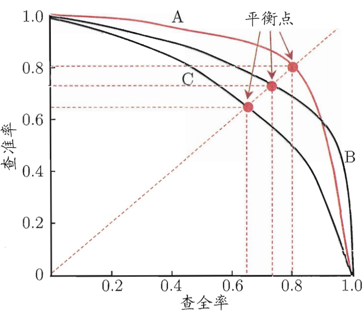
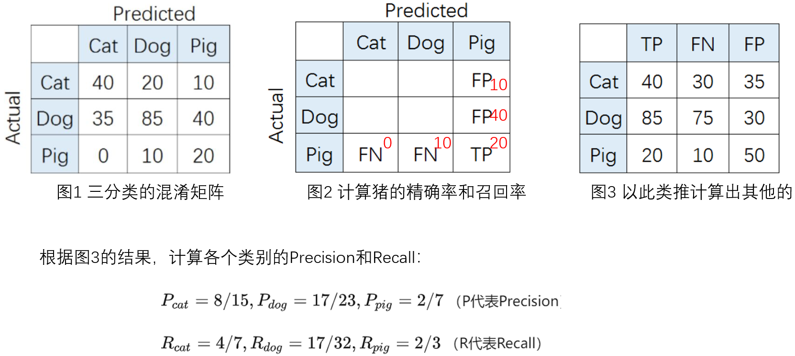
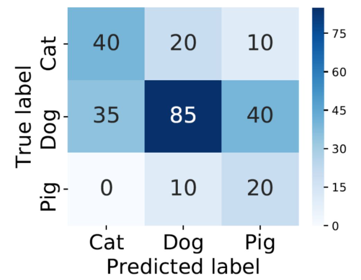

在机器学习中，分类任务常用的评价指标有Accuaracy、Precision、Recall、F1-score，它们分别有什么区别和用途？在什么场景下，该用什么指标衡量？

**一个小案例**：在分类问题中，一般最常用的是Accuracy，但是若样本不均衡，Accuracy指标就会出现较大的缺陷。例如：在一个三分类问题中，有100张图片，91张是狗，5张是猫，4张是猪，即便模型把猫和猪都预测成了狗，狗的预测精度也可以达到91%，此时的Accuracy指标就出现问题了。

**因此，在样本不均衡的情况下，就要引入Precision、Recall、F1-score进行评价。**

> 本文内容全部参考文献[1]，强烈推荐阅读原文，本文仅为学习笔记。

# 定义#

**名词解释：**

* **Precision**： 精确率（查准率）
* **Accuracy**： 准确率（精确度）
* **Recall**： 召回率（查全率）
* **F1-score**：同时考虑Precision和Recall的重要性。
* **True Positive (TP)**：真阳
* **False Positive (FP)**：假阳
* **True Negative (TN)** ：真阴
* **False Negative (FN)** ：假阴

**混淆矩阵：**

|      |          | Predicted |          |
| ---- | -------- | --------- | -------- |
|      |          | Positive  | Negative |
| True | Positive | TP        | FN       |
|      | Negative | FP        | TN       |

**计算公式：**

$$
\begin{aligned}
&\begin{aligned}
& \text { Accuracy }=\frac{T P+T N}{T P+T N+F P+F N} \\
& \text { Precision }=\frac{T P}{T P+F P} \\
& \text { Recall }=\frac{T P}{T P+F N}
\end{aligned}\\
&F 1-\text { score }=\frac{2 \times \text { Precision } \times \text { Recall }}{\text { Precision }+ \text { Recall }}=\left(\frac{\text { Precision }^{-1}+\text { Recall }^{-1}}{2}\right)^{-1}=\left(\frac{2+\frac{F P}{T P}+\frac{F N}{T P}}{2}\right)^{-1}
\end{aligned}
$$

# F1-score#

+ 单独看精确率和召回率，可以发现精确率高，召回率就低；召回率高，精精确率就低。

- 让F-score=1，可以从公式中发现TP要足够的大，FP和FN要足够的小。也就是同时满足了精确率和召回率要同时变大，即该公式同等程度的考虑了精确率和召回率的重要性。

<div align='center'>
    
</div>

# 二分类问题#

**概念的理解**

医院新开发了一套癌症AI诊断系统，想评估其性能好坏。我们把病人得了癌症定义为Positive，没得癌症定义为Negative。那么， 到底该用什么指标进行评估呢？

Precision: 在检测出癌症的人中，到底有多少人真正的得了癌症；

Recall：在真正的得了癌症的人群中到底有多少人被成功的检测出来了；

Accuracy：在所有的正常和患癌人群中，有多少人被给出了正确的诊断结果（患癌和没患癌）；

**什么时候注重Precision而不是Recall**

垃圾邮件分类：垃圾邮件标记为Positive，正常邮件未Negtive。

我们宁可把垃圾邮件预测为正常邮件（要增大FN），也不愿把正常邮件预测为垃圾邮件（要减小FP），此时Precision越大越好。

**什么时候注重Recall而不是Precision**

癌症检测：患癌为Positive, 正常为Negitive

我们宁可把正常的人误诊为癌症，也不愿意把确实患有癌症的给误诊为正常人（要降低FN），此时Recall越大越好。

**什么时候注重Recall和Precision同等重要**

既不冤枉一个好人，也绝不放过一个坏人，此时Recall和Precision就同等重要了，就是F1越高越好。

# 多分类问题#

对于多分类，需要单独的计算出各个类别的精确率和召回率。

<div align='center'>
    
</div>

如果想评估该识别系统的总体功能，必须考虑猫、狗、猪三个类别的综合预测性能。那么，到底要怎么综合这三个类别的Precision呢？下面以此介绍三种评价整体性能的方法：

## Macro-average方法

直接将不同类别的评估指标加起来求平均，给所有类别相同的权重。该方法能够平等看待每个类别，但是它的值会受稀有类别影响。

$$
\begin{aligned}
& \text { Macro-Precision }=\frac{P_{c a t}+P_{\text {dog }}+P_{p i g}}{3}=0.5194 \\
& \text { Macro-Recall }=\frac{R_{c a t}+R_{d o g}+R_{p i g}}{3}=0.5898
\end{aligned}
$$

## Weighted-average方法

该方法给不同类别不同权重，每个类别乘权重后再进行相加。该方法考虑了类别不平衡情况，它的值更容易受到常见类（majority class）的影响。

$$
总样本： N = 70+160+30=260 \\
权重：\mathrm{W}_{c a t}: \mathrm{W}_{\text {dog }}: \mathrm{W}_{p i g} = N_{c a t}: N_{\text {dog }}: N_{p i g}=\frac{70}{260}: \frac{160}{260}: \frac{30}{260}=\frac{7}{26}: \frac{16}{26}: \frac{3}{26} \\

Weighted-Precision=P_{\text {cat }} \times W_{\text {cat }}+P_{\text {dog }} \times W_{\text {dog }}+P_{\text {pig }} \times W_{\text {pig }}=0.6314 \\

Weighted-Recall = R_{\text {cat }} \times W_{\text {cat }}+R_{\text {dog }} \times W_{\text {dog }}+R_{\text {pig }} \times W_{\text {pig }}=0.5577
$$

## Micro-average方法

该方法把每个类别的TP, FP, FN先相加之后，在根据二分类的公式进行计算。

$$
\begin{aligned}
& \text { Micro-Precision }=\frac{T P_{\text {cat }}+T P_{\text {dog }}+T P_{\text {pig }}}{T P_{\text {cat }}+T P_{\text {dog }}+T P_{p i g}+F P_{\text {cat }}+F P_{\text {dog }}+F P_{p i g}}=0.5577 \\
& \text { Micro-Recall }=\frac{T P_{\text {cat }}+T P_{\text {dog }}+T P_{p i g}}{T P_{\text {cat }}+T P_{\text {dog }}+T P_{\text {pig }}+F N_{\text {cat }}+F N_{\text {dog }}+F N_{\text {pig }}}=0.5577 \\
& \text { Micro-F1 score }=\frac{2 \times \text { Micro-Precision } \times \text { Micro-Recall }}{\text { Micro-Precision }+ \text { Micro-Recall }}=\frac{2 \times 0.5577 \times 0.5577}{0.5577+0.5577}=0.5577 \\
& \text { Accuracy }=\frac{40+85+20}{260}=0.5577
\end{aligned}
$$

Micro-Precision $=$ Micro-Recall $=$ Micro-F1 score $=$ Accuracy

# 代码实现#

```python
import numpy as np
import seaborn as sns
from sklearn.metrics import confusion_matrix
import pandas as pd
import matplotlib.pyplot as plt
from sklearn.metrics import accuracy_score, average_precision_score,precision_score,f1_score,recall_score


# create confusion matrix
y_true = np.array([-1]*70 + [0]*160 + [1]*30)  # 各个类别的真实样本总个数
y_pred = np.array([-1]*40 + [0]*20 + [1]*20 +
                  [-1]*30 + [0]*80 + [1]*30 +
                  [-1]*5 + [0]*15 + [1]*20)  # y_pred为（260，）的数组
cm = confusion_matrix(y_true, y_pred) # 就是上图中的3*3的混淆矩阵数值
conf_matrix = pd.DataFrame(cm, index=['Cat','Dog','Pig'], columns=['Cat','Dog','Pig'])


# plot size setting
fig, ax = plt.subplots(figsize = (4.5,3.5))
sns.heatmap(conf_matrix, annot=True, annot_kws={"size": 19}, cmap="Blues")
plt.ylabel('True label', fontsize=18)
plt.xlabel('Predicted label', fontsize=18)
plt.xticks(fontsize=18)
plt.yticks(fontsize=18)
plt.savefig('confusion.pdf', bbox_inches='tight')
plt.show()
```

<div align='center'>
    
</div>

**输出：**

```python
print('------Weighted------')
print('Weighted precision', precision_score(y_true, y_pred, average='weighted'))
print('Weighted recall', recall_score(y_true, y_pred, average='weighted'))
print('Weighted f1-score', f1_score(y_true, y_pred, average='weighted'))

print('------Macro------')
print('Macro precision', precision_score(y_true, y_pred, average='macro'))
print('Macro recall', recall_score(y_true, y_pred, average='macro'))
print('Macro f1-score', f1_score(y_true, y_pred, average='macro'))

print('------Micro------')
print('Micro precision', precision_score(y_true, y_pred, average='micro'))
print('Micro recall', recall_score(y_true, y_pred, average='micro'))
print('Micro f1-score', f1_score(y_true, y_pred, average='micro'))
```

**参考：**

[1] [多分类模型Accuracy, Precision, Recall和F1-score的超级无敌深入探讨 - NaNNN的文章 - 知乎](https://zhuanlan.zhihu.com/p/147663370)
