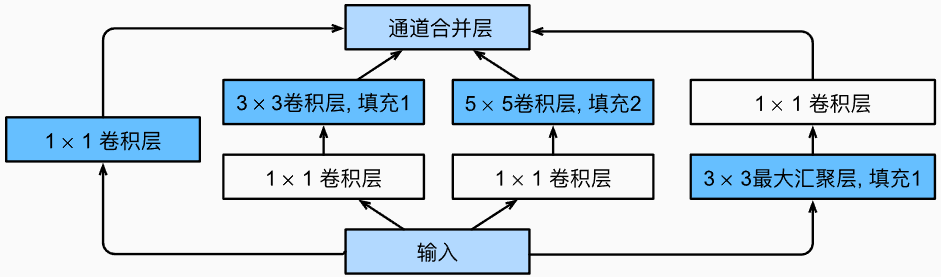

##  Inception块

在GoogLeNet中，基本的卷积块被称为Inception块（Inception block）。

+  使用窗口大小为$1\times1，3\times3，5\times5$的卷积层，从**不同空间**大小中提取信息。
+ 使用$1\times1$卷积层来改变通道数,可以降低通道维数。
+ 各层中窗口大小始终保持不变与输入的窗口一致。
+ 在Inception块中，通常调整的超参数是每层输出通道数。
+ 输出结果：各个路径的通道数相加，大小与输入大小一致。


**Inception卷积块：**



代码：

```python
import torch
from torch import nn
from torch.nn import functional as F


class Inception(nn.Module):
    def __init__(self, in_channels, c1, c2, c3, c4, **kwargs):
        super(Inception, self).__init__(**kwargs)
        self.p1_1 = nn.Conv2d(in_channels, c1, kernel_size=1)
        
        self.p2_1 = nn.Conv2d(in_channels, c2[0], kernel_size=1)
        self.p2_2 = nn.Conv2d(c2[0], c2[1], kernel_size=3, padding=1)
        
        self.p3_1 = nn.Conv2d(in_channels, c3[0], kernel_size=1)
        self.p3_2 = nn.Conv2d(c3[0], c3[1], kernel_size=5, padding=2)
        
        self.p4_1 = nn.MaxPool2d(kernel_size=3, stride=1, padding=1)
        self.p4_2 = nn.Conv2d(in_channels, c4, kernel_size=1)
        
    
    def forward(self, x):
        p1 = F.relu(self.p1_1(x))
        p2 = F.relu(self.p2_2(F.relu(self.p2_1(x))))
        p3 = F.relu(self.p3_2(F.relu(self.p3_1(x))))
        p4 = F.relu(self.p4_2(self.p4_1(x)))
        return torch.cat((p1, p2, p3, p4), dim=1)
```

**测试：**

```python
x = torch.randn(5, 3, 10, 10)
model = Inception(3, c1=8, c2=(2, 4), c3=(3, 6), c4=4)

# 用于打印模型每一层的输出结果
def print_outsize(module, x, y):
    print(module.__class__.__name__, y.shape)

for layer in model.children():
    layer.register_forward_hook(print_outsize)
        
out = model(x)
print('output:', out.shape)
```

**结果：**

```python
Conv2d torch.Size([5, 8, 10, 10])
Conv2d torch.Size([5, 2, 10, 10])
Conv2d torch.Size([5, 4, 10, 10])
Conv2d torch.Size([5, 3, 10, 10])
Conv2d torch.Size([5, 6, 10, 10])
MaxPool2d torch.Size([5, 3, 10, 10])
Conv2d torch.Size([5, 4, 10, 10])
output: torch.Size([5, 22, 10, 10])
```


## 参考文献

[1] [7.4. 含并行连结的网络（GoogLeNet） — 动手学深度学习 2.0.0 documentation (d2l.ai)](https://zh.d2l.ai/chapter_convolutional-modern/googlenet.html)