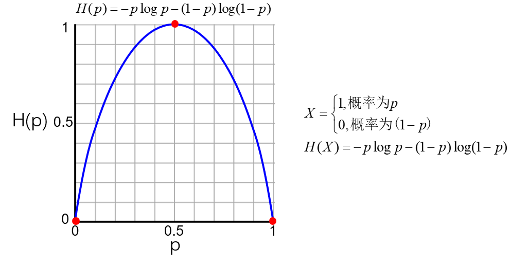
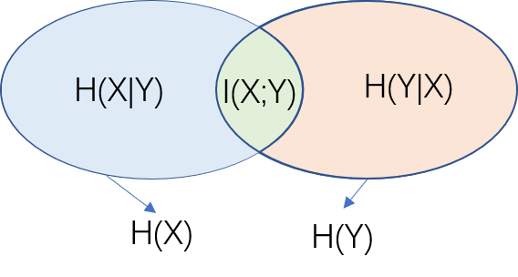

 熵用于度量系统的紊乱程度，但是在深度学习中常被用作一种度量准则。因此，有必要系统梳理熵的基本理论及其意义或者应用场景。

>其实这个是熵系列之前也学习过了，但是又忘记了。如果能把理论加以应用，这样才会有很深的印象。最近在看论文中，有几篇文章创新性的引入“熵”度量，简直是amazing啊，由此知道了熵的具体应用场合了！

# 1. 自信息

## 定义

自信息（self information）简言之，表示一个随机事件所包含的**信息量**。一个事件发生概率越高，表明其很“稳定”（丝毫没有悬念），则其所包含的信息量越少。

对于一个随机变量$$X$$(取值集合为$$\mathrm{\chi}$$，$$x\in\mathrm{\chi}$$)，当$$X=x$$时其发生概率为$$p(x)$$，对应的自信息$$I(x)$$为
$$
I(x)=-\log p(x)
$$

**注意：**

* 若log的底为2（默认），则单位是bit；（即$$\log_2p(x)=\log p(x)$$）
* 若底为$e$，则单位是nat；
* 若底为10，则单位是Hart；
* $$p(x)$$等价表示方法$$p(x)=P_{X}(\{X=x\})=p_X(x)$$，为随机变量取值$$x$$对应的概率。

## 代码

```python
import numpy as np

def self_information(p):
    if p > 0:
        value = -np.log2(p)
    else:
        value = float('inf')
    return value

if __name__ == "__main__":
    value = self_information(0.5)
    print(value)
```

# 2. 信息熵

## 定义

熵反应的是随机变量所含的平均信息量的大小，即**熵值越大，信息量就越大**。

随机变量$$X$$，其**自信息的期望**即为熵，即熵$$H(X)$$定义为

$$
\begin{align}
H(X) =& \mathbb{E}_X[I(X)] = \sum_{x\in \mathcal{X}}I(X)\times p(x) \\
     =& \mathbb{E}_X[-\log p(x)] \\
     =& \sum_{x\in \mathcal{X}}[-\log p(x)]\times p(x) \\
     =& \boxed{-\sum_{x\in\mathcal{X}}p(x)\log p(x)}
\end{align}
$$

**注意：**

+ $$0\times \log 0=0$$
+ 信息熵反应的是**最优的平均编码长度**（事件发生概率越大，则编码长度越短），称为**熵编码**

**案例：**

如下图所示为一个伯努利分布（也称0-1分布或者两点分布）的信息熵的分布曲线，事件发生的概率为$$p$$$，不发生的概率为$$(1-p)$。

可以发现：**在概率为0或者1时，熵为零，表明事件是确定的；在概率为0.5时，事件所含的信息量最大，此时不确定性最大。**

<div align='center'>
    
</div>

## 代码

```python
import numpy as np


def entropy(p_list):
    """
    计算信息熵：H(X)=-\sum {p(x)log[p(x)]}
    p_list: 概率列表，list type, size (n,)
    return: entropy, a scaler value
    """
    
    # 如果p_list中有小于零的值，则报错
    if any(p < 0 for p in p_list):
        raise ValueError("Probabilities cannot be less than zero.")

    entropy = 0
    for p in p_list:
        if p > 0:
            entropy -= p * np.log2(p)
        
    return entropy


if __name__ == "__main__":
    p_list = [0.5, 0.25, 0.125, 0.125]
    value = entropy(p_list)
    print('entropy:', value, 'bit')
```

# 3. 联合熵

**定义：**

$$
H(X, Y)=-\sum_{x\in \mathcal{X}}\sum_{y \in \mathcal{Y}}p(x,y)\log p(x,y)
$$

**注意：**

+ $$H(X,Y)=H(Y,X)$$

# 4. 条件熵

**定义：**
$$
\begin{align}
H(Y|X) &=\sum_{x\in \mathcal{X}}p(x)H(Y|X=x)\\
       &= -\sum_{x\in\mathcal{X}}p(x)\sum_{y\in\mathcal{Y}}p(y|x)\log p(y|x) \\
       &= \boxed{-\sum_{x\in\mathcal{X}}\sum_{y\in\mathcal{Y}}p(x,y)\log p(y|x) }\\
\end{align}
$$

# 5. 互信息

**定义：**

互信息（mutual information） ，通俗来讲就是度量两个随机变量的相互依赖程度。

> 官话：在给定一个随机变量的前提下，原随机变量不确定度的缩减量。


$$
\begin{align} 
I(X;Y) &= \sum_{x\in\mathcal{X}} \sum_{y\in\mathcal{Y}} p(x,y)\log \frac{p(x,y)}{p(x)p(y)} \\
       &= D_{KL}(P(x,y)||P(x)P(y))
\end{align}
$$

**性质：**

* $I(X;Y)=I(Y;X)$
* $I(X;Y)=H(X)-H(X|Y)=H(Y)-H(Y|X)$


<div align='center'>
    
</div>


# 3. 相对熵（KL散度）


# 4. JS散度


# 5. 交叉熵


# 


# 


# 


# 前置知识

整理了推导前面公式时可能需要用到的一些基本知识点，便于快速学习和透彻理解熵的相关知识。

## 离散随机变量

所谓离散随机变量是指，随机变量的取值是有限集合，如：掷一次骰子，则随机变量$X$的可能取值为$\{1,2,3,4,5,6\}$。

**表示：**用大写字母表示随机变量$X$，取值有限集合$X=\{x_1, x_2, x_3, \cdots,x_k\}$，$P(X=x_i)$表示随机变量$X$取值为$x_i$时事件对应的概率。

## 概率质量函数

连续型随机变量有**概率密度函数**，但是离散型型随机变量没有，但是离散型随机变量叫**概率质量函数**（probability mass function, PMF）。通俗的来说，对于离散随机变量的每一个取值，**PMF**可以给出一个实数概率值。

**定义：**PMF用于表示随机变量$$\mathbf{X}$$对应的取值$$x$$的概率函数，记$$p_{X}(x)=P(\{X=x\})$$，概率质量函数满足如下性质：
$$
\sum_x{p_{X}(x)}=1
$$

式中，$$x$$是随机变量的取值（实数值）因此表示为随机变量$$X$$所有可能取值的概率之和为1.

**eg**：随机抛硬币，$$X$$表示向上的次数，则$$X$$的概率质量函数为
$$
p_{X}(x)=
\begin{cases}
	1/4, x=0\ or\  2\\
	1/2, \ x=1 \\
	0, \ others \\
\end{cases}
$$

## 期望

**离散随机变量：**
$$
\mathbb{E}[X]=\sum_{x}xP(X=x)
$$

式中，$$X$$是随机变量，$$x$$是随机变量的取值，$$P(X=x)$$表示随机变量取值$$x$$时的概率。

**连续型随机变量：**

$$
\mathbb{E}[X]=\int_{-\infty}^{\infty}xf_X(x)\rm{d}\it{x}
$$

式中，$$f_X$$是随机变量$$X$$的概率密度函数。

## 离散随机变量概率分布

介绍几种常见随机变量及其概率质量函数，包括**伯努利随机变量**、**二项随机变量**、**几何随机变量**、**泊松随机变量**。

### 伯努利随机变量

**定义：**伯努利试验成功，则随机变量取值为1；伯努利试验失败，则随机变量取值为0。记事件成功的概率为$p$，事件失败的概率为$1-p$。伯努利随机变量概率分布称为**伯努利分布**（也称，**两点分布**或**0-1分布**）。具体表示如下，

随机变量取值：

$$
X=
\begin{cases}
1, \ 事件成功 \\
0, \ 事件失败 \\
\end{cases}
$$

概率质量函数：

$$
p_X(x)=
\begin{cases}
p,& x=1 \\
1-p,& x=0 \\
\end{cases}
$$

### 二项随机变量


### 几何随机变量


### 泊松随机变量


# References

* 《神经网络与深度学习》邱锡鹏
* 《信息论基础》Thomas M. Cover
* 《概率导论》Dimtri P. Bertsekas, John N. Tsitkils
