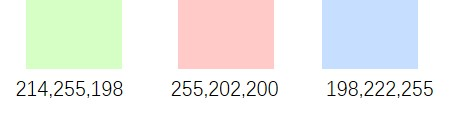

>一些汇总！

# 期刊汇总

**故障诊断**

| 期刊简称 | 期刊全称                                    | 中科院分区 |  IF  |
| :------: | ------------------------------------------- | :--------: | :--: |
|   MSSP   | Mechanical Systems and Signal Processing    |     1      | 8.4  |
|   ESA    | Expert Systems with Applications            |     1      | 8.5  |
|   AEI    | Advanced Engineering Informatics            |     1      | 8.8  |
|   KBS    | Knowledge-Based Systems                     |     1      | 8.8  |
|   ISA    | ISA Transactions                            | 2 （top）  | 7.3  |
|   TII    | IEEE Transactions on Industrial Informatics |     1      | 12.3 |
|   TIE    | IEEE Transactions on Industrial Electronics |     1      | 7.7  |
|   JIM    | Journal of Intelligent Manufacturing        |     1      | 8.3  |
|   JMS    | Journal of Manufacturing Systems            |     1      | 12.1 |

**人工智能会议**

| 会议简称 | 全称                                                        | 领域 |
| :------: | ----------------------------------------------------------- | :--: |
|   AAAI   | AAAI Conference on Artificial Intelligence                  |  AI  |
|  IJCAI   | International Joint Conference on Artificial Intelligence   |  AI  |
|   CVPR   | IEEE/CVF Computer Vision and Pattern Recognition Conference |  CV  |
|   ICCV   | IEEE International Conference on Computer Vision            |  CV  |
|   ICML   | International Conference on Machine Learning                |  ML  |
| NeurIPS  | Conference on Neural Information Processing Systems         |  ML  |

**人工智能期刊**

| 期刊简称 | 全称                                                         | 领域 |
| :------: | ------------------------------------------------------------ | :--: |
|   AIJ    | Artificial Intelligence Journal                              |  AI  |
|   PAMI   | IEEE Transactions on Pattern Analysis and Machine Intelligence |  CV  |
|   IJCV   | International Journal of Computer Vision                     |  CV  |
|   TIP    | IEEE Transactions on Image Processing                        |  CV  |
|   JMLR   | Journal of Machine Learning Research                         |  ML  |
|    PR    | Pattern Recognition                                          |  PR  |

# 迁移学习

**博客**

* [Transfer learning ](https://github.com/jindongwang/transferlearning/tree/master)：王晋东博士维护的迁移学习代码库。
  * [baisc distance metric](https://github.com/jindongwang/transferlearning/tree/master/code#basic-distance-%E5%B8%B8%E7%94%A8%E7%9A%84%E8%B7%9D%E7%A6%BB%E5%BA%A6%E9%87%8F): 如MMD, MK-MMD, A-distance, coral loss, wasserstein distacne等。
  
  * [deep feature extractor](https://github.com/jindongwang/transferlearning/tree/master/code#deep-feature-extractor-%E6%8F%90%E5%8F%96%E6%B7%B1%E5%BA%A6%E7%BD%91%E7%BB%9C%E7%89%B9%E5%BE%81%E7%94%A8%E4%BA%8E%E4%BC%A0%E7%BB%9F%E6%96%B9%E6%B3%95): 提取深度网络特征用于传统方法。
  * [deep domain adaptation]([transferlearning/code/DeepDA at master · jindongwang/transferlearning (github.com)](https://github.com/jindongwang/transferlearning/tree/master/code/DeepDA)): DDC,  Depp Coral,  DANN(Domain-adversarial neural network ),  DSAN,  DAAN(Dynamic Adversarial Adaptation Network),  BNM。

**代码**

# 生成对抗网络

**博客**

* [TwistedW](http://www.twistedwg.com/pages/class.html): 跟踪了18~20年几乎所有GAN文章。

* [苏剑林 - 科学空间](https://kexue.fm/category/Big-Data ): 一直在跟踪GAN系列发展，数学理论深厚，见解独到。

* [郑之杰的个人网站 ](https://0809zheng.github.io/tags.html#深度学习)：其中的**GAN**、**数学**专栏推荐学习。

 **代码**

* 

# 故障诊断

**博客**

* 

**代码**

* 

# SCI写作

**配色网址：**

+ [colorbrewer2](https://colorbrewer2.org/)

+ [一个推荐配色网址的博客文章](https://www.molecularecologist.com/2020/04/23/simple-tools-for-mastering-color-in-scientific-figures/)

**三色**：

