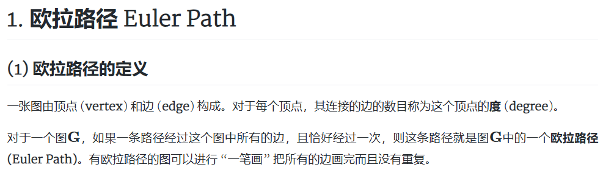

> 这是一个速览。

本文目录：
1. xxx
2. xxx
3. html: ./imgs/cover_1.png

    

* ./imgs/cover_1.png

  

    

## markdown语法

* ../../imgs/test/t.jpg

* ../../imgs/theme.jpg

## html语法

* ../../imgs/test/t.jpg

    

+ ../../imgs/theme.jpg

    

