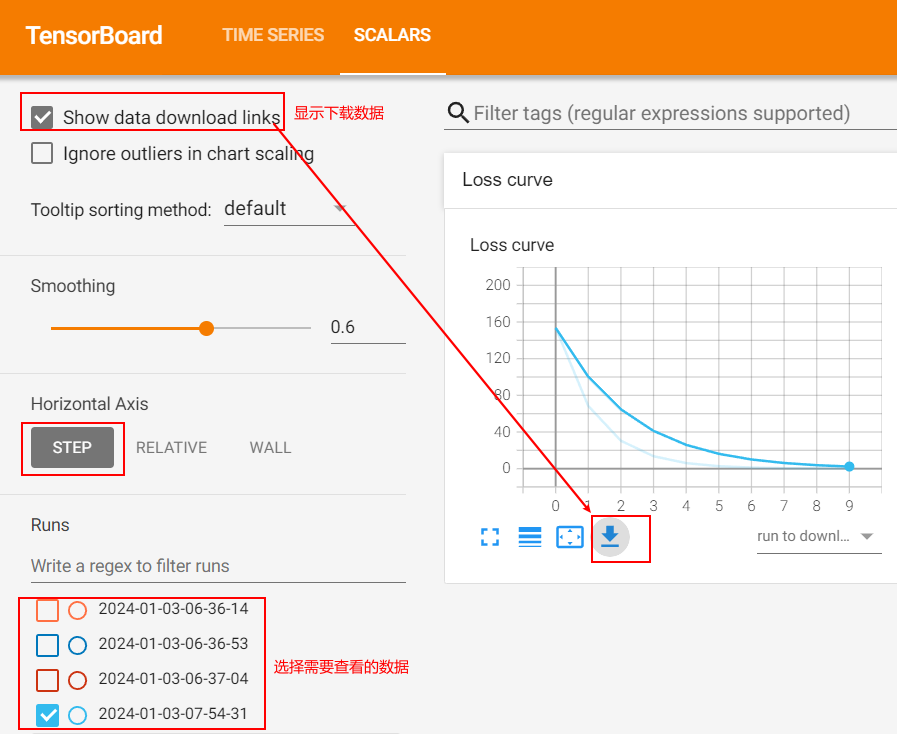
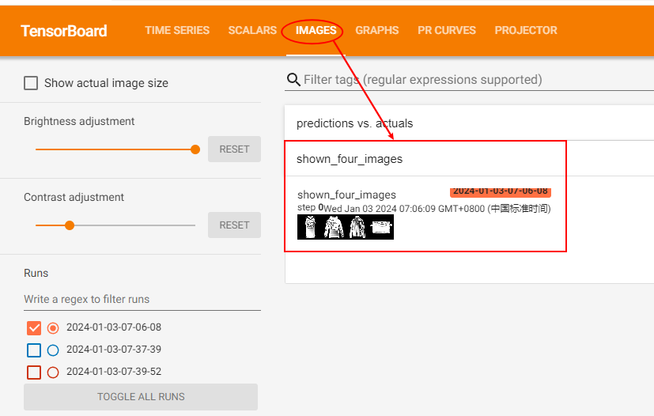
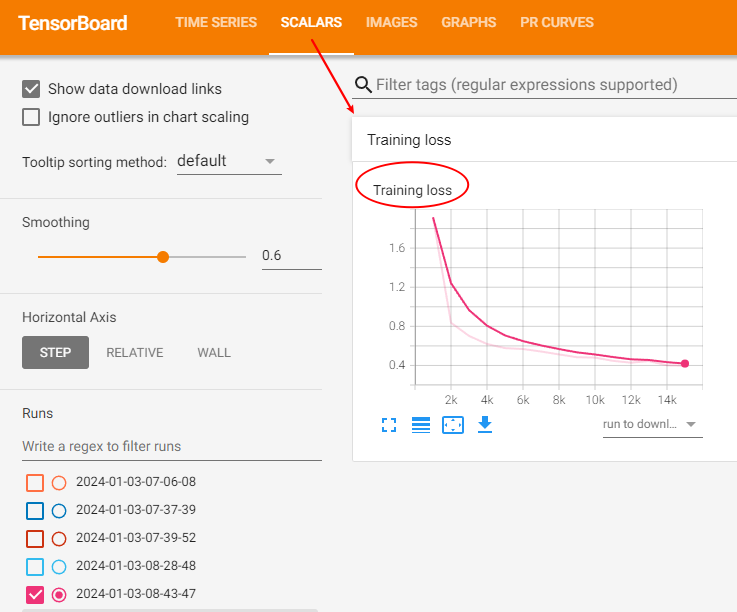
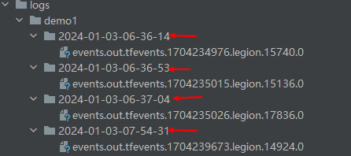
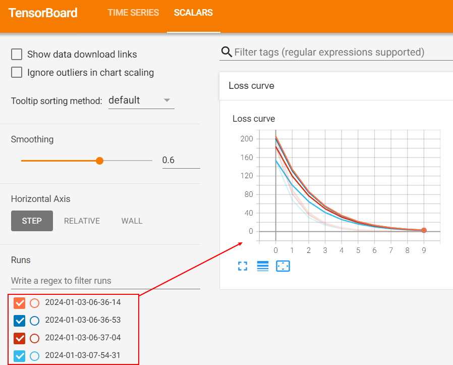

# 快速入门

一个简单的tensorboard入门案例:

```python
import torch
from torch.utils.tensorboard import SummaryWriter
from datetime import datetime

time_now = "{0:%Y-%m-%d-%H-%M-%S/}".format(datetime.now()) # 获取当前时间
# writer = SummaryWriter()这种写法默认自动新建runs文件夹，将每次训练的事件都保存在runs文件夹下
writer = SummaryWriter(f'logs/demo1/{time_now}') # 推荐这种写法SummaryWriter(f'logs/{time_now}')

x = torch.arange(-5, 5, 0.1).view(-1, 1)
y = -5 * x + 0.1 * torch.randn(x.size())

model = torch.nn.Linear(1, 1)
criterion = torch.nn.MSELoss()
optimizer = torch.optim.SGD(model.parameters(), lr = 0.1)

def train_model(iter):
    for epoch in range(iter):
        y1 = model(x)
        loss = criterion(y1, y)
        
        # 写入标量值
        writer.add_scalar("Loss curve", loss, epoch) # 取个标题名; 传入变量值；步长

        optimizer.zero_grad()
        loss.backward()
        optimizer.step()

train_model(10)
writer.close()
```

运行完成之后，在终端`Terminal`输入：

```python
tensorboard --logdir=logs/demo1 # 前面保持不变，后面logs/demo1为事件所在文件夹
```

可视化操作界面：
<div align='center'>
    
</div>

上述默认配置，保持不变即可。

# 认识Tensorboard

这个案例以一个基本CNN模型切入点，讲解tensorboard的一些可能的用法，较上一个案例更难，但更加全面。

## 导入模块

```
import matplotlib.pyplot as plt
import numpy as np
import torch
import torchvision
import torchvision.transforms as transforms
import torch.nn as nn
import torch.nn.functional as F
import torch.optim as optim
from torch.utils.tensorboard import SummaryWriter
from datetime import datetime

# 下面这三行代码用于解决writer.add_embedding报错问题
# 注意：使用writer.add_embedding必加下面代码
import tensorflow as tf
import tensorboard as tb
tf.io.gfile = tb.compat.tensorflow_stub.io.gfile
```

## 准备工作

数据准备、处理、搭建模型、损失函数、优化器...

```python
transform = transforms.Compose(
    [transforms.ToTensor(),
    transforms.Normalize((0.5,), (0.5,))])

trainset = torchvision.datasets.FashionMNIST('./data', download=True, train=True, transform=transform)
testset = torchvision.datasets.FashionMNIST('./data', download=True, train=False, transform=transform)

trainloader = torch.utils.data.DataLoader(trainset, batch_size=4, shuffle=True)
testloader = torch.utils.data.DataLoader(testset, batch_size=4, shuffle=False)

# lable - txt class
classes = ('T-shirt/top', 'Trouser', 'Pullover', 'Dress', 'Coat',
        'Sandal', 'Shirt', 'Sneaker', 'Bag', 'Ankle Boot')

# helper function to show an image
def matplotlib_imshow(img, one_channel=False):
    if one_channel:
        img = img.mean(dim=0)
    img = img / 2 + 0.5     # unnormalize
    npimg = img.numpy()
    if one_channel:
        plt.imshow(npimg, cmap="Greys")
    else:
        plt.imshow(np.transpose(npimg, (1, 2, 0)))


class Net(nn.Module):
    def __init__(self):
        super(Net, self).__init__()
        self.conv1 = nn.Conv2d(1, 6, 5)
        self.pool = nn.MaxPool2d(2, 2)
        self.conv2 = nn.Conv2d(6, 16, 5)
        self.fc1 = nn.Linear(16 * 4 * 4, 120)
        self.fc2 = nn.Linear(120, 84)
        self.fc3 = nn.Linear(84, 10)

    def forward(self, x):
        x = self.pool(F.relu(self.conv1(x)))
        x = self.pool(F.relu(self.conv2(x)))
        x = x.view(-1, 16 * 4 * 4)
        x = F.relu(self.fc1(x))
        x = F.relu(self.fc2(x))
        x = self.fc3(x)
        return x


net = Net()

criterion = nn.CrossEntropyLoss()
optimizer = optim.SGD(net.parameters(), lr=0.001, momentum=0.9)
```

## Tensorboard建立

```python
# 将日志写在指定路径下（不指定，则默认写在runs文件夹下）
time_now = "{0:%Y-%m-%d-%H-%M-%S/}".format(datetime.now())
writer = SummaryWriter(f'logs/demo2/{time_now}')
```

## 写入`add_image`

```python
dataiter = iter(trainloader)
images, labels = next(dataiter)

img_grid = torchvision.utils.make_grid(images) # 创建图片网格
matplotlib_imshow(img_grid, one_channel=True) # 显示图片

writer.add_image("shown_four_images", img_grid) # 写入图片
```

此处需要注意的是，`writer.add_image`接受的是***torch.Tensor, numpy.array***等类型的data数据(image data)。可视化结果如下：

<div align='center'>
    
</div>

## 模型结构可视化：`add_graph`

作用：对模型的结构进行可视化，用于展示模型的构成和参数设置。

```python
writer.add_graph(net, images) # 可视化模型结构
```

可视化结果：

<div align='center'>
    
</div>

## 数据降维：`add_embedding`

作用：相当于一个映射器，将高维数据嵌入到低维表达。

```python
def select_n_random(data, labels, n=100): # 从数据集中随机取100张图片
    perm = torch.randperm(len(data))
    return data[perm][:n], labels[perm][:n]

images, labels = select_n_random(trainset.data, trainset.targets)
class_labels = [classes[lab] for lab in labels] # label标签对应的label_text


# mat是N x D的矩阵，N代表样本个数，D代表嵌入维数
# label_img是待降维的图片，大小为N x C x H x W
writer.add_embedding(mat=images.view(-1, 28 * 28), # (100, 28, 28)->(100, 28*28)
                    metadata=class_labels,
                    label_img=images.unsqueeze(1)) # (100, 1, 28, 28)
```

可视化结果：
<div align='center'>
    
</div>

## 跟踪模型训练：`add_figure`、`add_scalar`

```python
def images_to_probs(net, images):
    '''return: (prediction_label, probability)'''
    output = net(images)
    # convert output probabilities to predicted class
    _, preds_tensor = torch.max(output, 1)
    preds = np.squeeze(preds_tensor.numpy())
    return preds, [F.softmax(el, dim=0)[i].item() for i, el in zip(preds, output)]


def plot_classes_preds(net, images, labels):
    '''
    Generates matplotlib Figure using a trained network, along with images
    and labels from a batch, that shows the network's top prediction along
    with its probability, alongside the actual label, coloring this
    information based on whether the prediction was correct or not.
    Uses the "images_to_probs" function.
    '''
    preds, probs = images_to_probs(net, images)
    # plot the images in the batch, along with predicted and true labels
    fig = plt.figure(figsize=(12, 48))
    for idx in np.arange(4):
        ax = fig.add_subplot(1, 4, idx+1, xticks=[], yticks=[])
        matplotlib_imshow(images[idx], one_channel=True)
        ax.set_title("{0}, {1:.1f}%\n(label: {2})".format(
            classes[preds[idx]],
            probs[idx] * 100.0,
            classes[labels[idx]]),
                    color=("green" if preds[idx]==labels[idx].item() else "red"))
    return fig


running_loss = 0.0
for epoch in range(1):
    for i, data in enumerate(trainloader, 0):
        inputs, labels = data
        optimizer.zero_grad()
        outputs = net(inputs)
        loss = criterion(outputs, labels)
        loss.backward()
        optimizer.step()

        running_loss += loss.item()
        if i % 1000 == 999:    # 每1000次batch记录一次平均loss
            writer.add_scalar('Training loss',
                            running_loss / 1000,
                            epoch * len(trainloader) + i)

            # ...log a Matplotlib Figure showing the model's predictions on a
            # random mini-batch
            writer.add_figure('predictions vs. actuals',
                            plot_classes_preds(net, inputs, labels),
                            epoch * len(trainloader) + i)
            running_loss = 0.0
```

## 模型评估PR曲线：`add_pr_curve`

```python
class_probs = []
class_label = []
with torch.no_grad():
    for data in testloader:
        images, labels = data
        output = net(images)
        class_probs_batch = [F.softmax(el, dim=0) for el in output]

        class_probs.append(class_probs_batch)
        class_label.append(labels)

test_probs = torch.cat([torch.stack(batch) for batch in class_probs])
test_label = torch.cat(class_label)

# helper function
def add_pr_curve_tensorboard(class_index, test_probs, test_label, global_step=0):
    '''
    Takes in a "class_index" from 0 to 9 and plots the corresponding
    precision-recall curve
    '''
    tensorboard_truth = test_label == class_index
    tensorboard_probs = test_probs[:, class_index]

    writer.add_pr_curve(classes[class_index],
                        tensorboard_truth,
                        tensorboard_probs,
                        global_step=global_step)

# plot all the pr curves
for i in range(len(classes)):
    add_pr_curve_tensorboard(i, test_probs, test_label)

plt.show()
```

可视化结果：

<div align='center'>
    
    
</div>

## 结束

```python
writer.close()
```

# 经典案例

## 可视化模型的梯度


# 常见问题汇总

### （1）多个events事件显示混乱问题

当在同一个文件夹下保存了多个envents事件，可视化的时候就会同时将其展示在一张图上，就会出现混乱。解决办法：

一个事件保存在一个文件夹下，即每次训练程序之后log保存在一个新建的文件夹下。

**采用如下方法对`log_dir`进行命名**：

```python
from datetime import datetime

time_now = "{0:%Y-%m-%d-%H-%M-%S/}".format(datetime.now())
writer = SummaryWriter(f'logs/demo1/{time_now}')
```


<div align='center'>
    
</div>

可视化效果如下：

<div align='center'>
    
</div>


# 参考

[1] [Visualizing Models, Data, and Training with TensorBoard — PyTorch Tutorials 2.2.0+cu121 documentation](https://pytorch.org/tutorials/intermediate/tensorboard_tutorial.html)

[2] [How to use TensorBoard with PyTorch — PyTorch Tutorials 2.2.0+cu121 documentation](https://pytorch.org/tutorials/recipes/recipes/tensorboard_with_pytorch.html)

