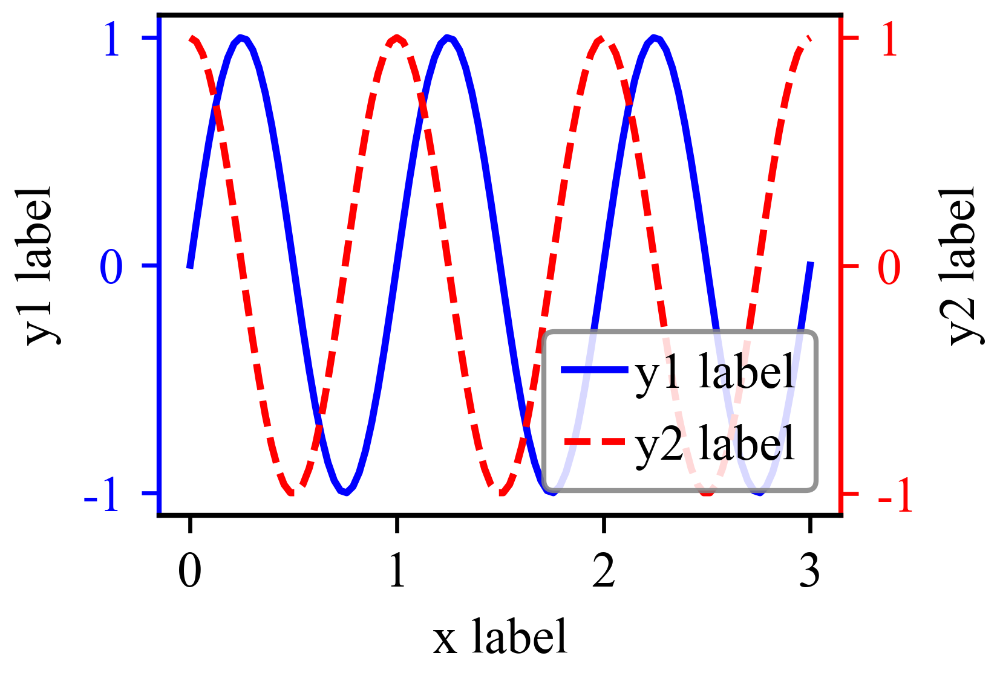

本程序已经完全定制化了，只需要更改`double_Y_curve`相应的参数设置，即可绘制符合自己需求的SCI图片。

```python
from matplotlib import pyplot as plt
import numpy as np


def double_Y_curve(x, y1, y2, x_label, y1_lable, y2_label,
                   is_save=False, fig_name='YY_curve', save_path='./',
                   w=7, h=7*0.68, glob_font_size=10, marker1=None, marker2=None,
                   border_line_wd=1, line_wd=1.4, show_legend=True, leg_loc='lower right', show_box=True,
                   leg_coord=None, leg_ncol=1, leg_alpha=0.85, leg_borderwd=1.0, leg_edgcolor='grey',
                   leg_rowh=0.5, leg_colw=0.5, leg_labeltxtw=0.2, leg_handw=1.2, leg_boxaxew=0.5, format='svg'):
    """
    作用：绘制SCI论文中双Y轴折线图
    :param x: x轴数据
    :param y1: y1轴（左侧轴）数据
    :param y2: y2轴（右侧轴）数据
    :param x_label: label name
    :param y1_lable: y1 axis label name
    :param y2_label: y2 axis label name
    :param is_save (default: False): "True" to save figure, "False" to show figure
    :param fig_name: 图片命名
    :param save_path: 图片保存路径
    :param w: 图片的宽（cm）
    :param h: 图片的长 （cm）
    :param glob_font_size (default: 10): 全局字体大小(pt)
    :param marker1: 是否给曲线y1加marker符号，可选：">", "*", "o", "^"
    :param marker2: 是否给曲线y1加marker符号，可选：">", "*", "o", "^"
    :param border_line_wd: figure的四条线宽
    :param line_wd: line线宽
    :param show_legend (default: True): 是否显示legend
    :param leg_loc: legend放置位置，如‘upper left’, 'upper center' 'upper right', 'center left', 'center', 'center right', 'lower left', 'best'
    :param show_box (default: True): 是否显示legend的四条边框
    :param leg_coord (default: None):legend定位作为与leg_loc一起定位
    :param leg_ncol: legend的列数
    :param leg_alpha: 透明度
    :param leg_borderwd:
    :param leg_edgcolor: 边框颜色
    :param leg_rowh: 行间距
    :param leg_colw: 列与列之间的间距
    :param leg_labeltxtw: ”---  legend1"：表示”---“与”legend1“之间的间距大小
    :param leg_handw: ”---“的长度
    :param leg_boxaxew: 若leg_loc=”lower right“，则表示legend长方形盒子右下角这个点与点(0,1)之间的距离大小
    :param format (default: svg): 可选'png', 'pdf', 'svg',....
    """

    # 绘图参数设置
    plt.rcParams['font.sans-serif'] = ['Times New Roman']  # 设置字体
    plt.rcParams['axes.unicode_minus'] = False             # 修正减号与负号的区别
    plt.rcParams.update({'font.size': glob_font_size})     # 全局字体大小
    dpi = 600
    leg_font = {'family': 'Times New Roman', 'style': 'normal', 'size': glob_font_size}  # 图例字体

    # 绘图
    fig, ax1 = plt.subplots(figsize=(w / 2.54, h / 2.54), constrained_layout=True)
    line1 = ax1.plot(x, y1, label=y1_lable, color='b', marker=marker1, linewidth=line_wd)
    ax1.set_ylabel(y1_lable)
    ax1.set_xlabel(x_label)

    ax2 = ax1.twinx()
    line2 = ax2.plot(x, y2, label=y2_label, color='r', linestyle='--', marker=marker2, linewidth=line_wd)
    ax2.set_ylabel(y2_label)

    # 设置轴标签颜色
    ax1.tick_params('y', colors='b')
    ax2.tick_params('y', colors='r')
    
    # 设置轴颜色
    ax1.spines['left'].set_color('b')
    ax2.spines['left'].set_color('b')
    ax1.spines['right'].set_color('r')
    ax2.spines['right'].set_color('r')

    # set border line width
    TK = plt.gca()  # 获取边框
    TK.spines['top'].set_linewidth(border_line_wd)
    TK.spines['right'].set_linewidth(border_line_wd)
    TK.spines['left'].set_linewidth(border_line_wd)
    TK.spines['bottom'].set_linewidth(border_line_wd)

    # 设置legend
    # loc: ‘upper left’, 'upper center' 'upper right', 'center left', 'center', 'center right', 'lower left', 'best'
    # bbox_to_anchor: (0, 0), (1, 0.5)
    if show_legend:
        lines = line1 + line2
        labels = [h.get_label() for h in lines]
        legend = plt.legend(lines, labels,
            bbox_to_anchor=leg_coord,  # （x, y）范围: (0,0) --> (1, 1)
            loc=leg_loc,  # 将legend的角“loc”放在位置“bbox_to_anchor”上，如将leged的左下角“lower left”对齐坐标（1， 0）
            ncol=leg_ncol,
            prop=leg_font,
            labelspacing=leg_rowh,
            columnspacing=leg_colw,
            handletextpad=leg_labeltxtw,
            edgecolor=leg_edgcolor,
            borderaxespad=leg_boxaxew,
            fancybox=True,  # 是否使用圆角边框
            frameon=show_box,  # 是否显示图框
            framealpha=leg_alpha,
            handlelength=leg_handw,  # 左边符号的宽度
            )
        frame = legend.get_frame()
        frame.set_linewidth(leg_borderwd)

    # 保存图片
    import os
    if is_save:
        plt.savefig(os.path.join(save_path, f'{fig_name}.{format}'), dpi=dpi)
        plt.clf()
        plt.close()
    else:
        plt.show()


if __name__ == '__main__':
    x = np.linspace(0, 3, 100)
    y1 = np.sin(2 * np.pi * x)
    y2 = np.cos(2 * np.pi * x)
    x_label, y1_lable, y2_label = "x label", "y1 label", "y2 label"
    fig_name = "my_yy_curve" # 保存图片的名字
    save_path = './'         # 图片保存的路径

    double_Y_curve(x, y1, y2, x_label, y1_lable, y2_label, is_save=True, fig_name=fig_name, save_path=save_path, format='png')
```

结果如下：
<div align='center'>
    
</div>


**参考：**

[1] https://zhuanlan.zhihu.com/p/634634968

