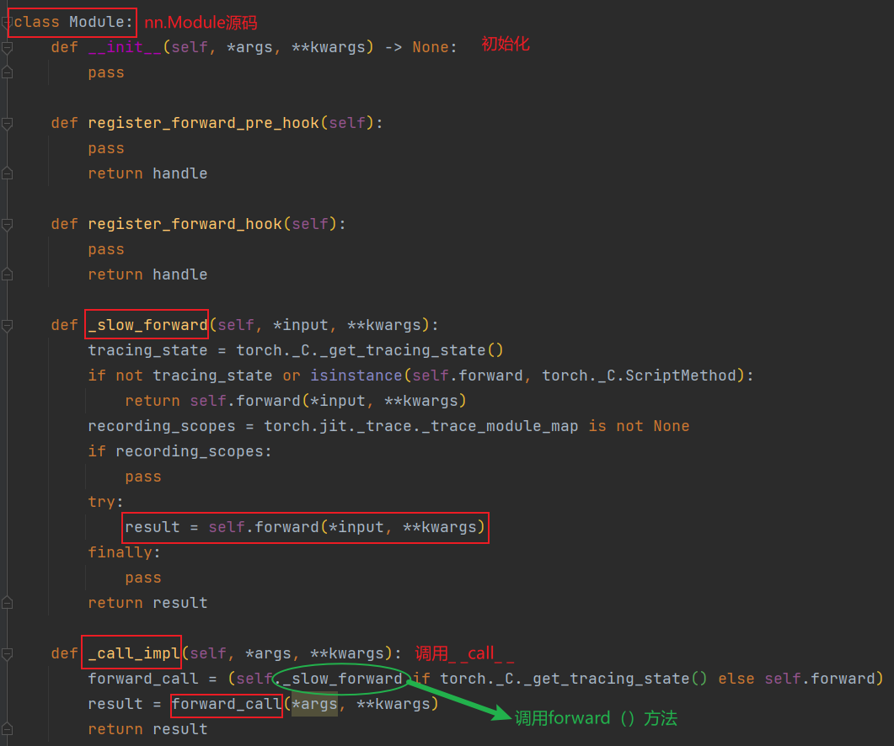

关于`__call__`和`forward`的用法一直有几个较为困惑的地方，如下：

+ 类实例化之后就会直接调用`__call__`方法，然后输出该方法的return结果。为什么不直接定义函数，定义class岂不显得多此一举？
+ `forawrd`方法一般继承了父类，而父类中已经定义了`__call__`方法，所以实例化之后，你不需要`model.forward(x)`，直接`model(x)`即可调用类下面的`forward()`方法？
+ 如果一个类下面既有`__call__`和`forward`该怎么执行，如果考虑继承和不继承会出现什么情况？

因此，接下来将以案例的形式解决上述三个问题。

#  `__call__`魔术方法#

为了区别该魔术方法(class)和一般的定义函数方法(function)，下面用两个demo加以说明。

**`__call__`案例：**

```python
class Squarer:
    def __call__(self, x): # 魔术方法
        return x * x

squarer = Squarer()  # 类的实例
result = squarer(5)  # 可以像函数一样直接调用
```

**定义一个类def的案例：**

```python
class Squarer:
    def _call(self, x): # 类方法
        return x * x

squarer = Squarer()
result = squarer._call(5) # 显示调用类下面函数
```

**小结：**魔术方法更加简洁，使得类的实例可以像函数一样被调用。

下面进一步分析该魔术方法相比类方法的优势所在。具体而言，`__call__`在对象状态保持或者配置时更具有优势。接下来仍然用两个案例加以说明状态保持的重要性。

**`__call__`案例：**

```python
class Counter:
    def __init__(self):
        self.count = 0

    def __call__(self):
        self.count += 1
        return self.count

counter = Counter()
print(counter())  # 输出：1
print(counter())  # 输出：2
```

**定义一个类def的案例：**

```python
class Counter:
    def __init__(self):
        self.count = 0

    def increment(self):
        self.count += 1
        return self.count

counter = Counter()
print(counter.increment())  # 输出：1
print(counter.increment())  # 输出：2
```

**小结：**第二种方法需要频繁的显示调用类方法来改变这种状态，第一种方法可以保持内部状态。

# forward方法#

需要注意的是，所谓的forward一般而言指的是PyTorch的`nn.Module`子类下面的`forward`方法。下面通过一个案例分析`forward`的执行流程，以及与`__call__`顺序关系。

**有继承关系：**

详细分析PyTorch框架中的`nn.Module`模块执行流程。

```python
import torch.nn as nn

class Model(nn.Module): # 继承父类nn.Module
    def __init__(self):
        super(MyModule, self).__init__()
        # 初始化操作...

    def forward(self, x):
        # 定义前向传播逻辑
        return x

model = Model()
output = model(x)  # 这里实际调用了 __call__，它又调用了 forward
```

可以看出，由于子类Model继承了父类nn.Module的方法，因此，模型的执行流程分为以下几步：

1. 模型实例化model = Model()：首先执行父类nn.Module下面的`__init__`初始化，然后执行子类Model下面的`__init__`初始化。
2. 模型推理output = model(x)：执行父类nn.Module下面的`__call__`方法，在该函数内部会调用`forward()`函数，然后将`forward()`函数返回的结果传递给`__call__`方法，最后`__call__`方法将该结果return给output。

结合上面的分析流程，接下来看一下`nn.Module`源码结构：
<div align='center'>
    
</div>


**无继承关系：**

上面用的是PyTorch框架，用继承实现了`__call__`和`forward`的连接，接下来从直观上理解（不采用继承nn.Module）两者之间是如何传递信息的。

```python
class Module:
    def __init__(self, a):
        '''程序在实例化的时候就会自动初始化该方法'''
        print('__init__被调用了，初始化值：', a)
    
    def __call__(self, param):
        '''
        1、__call__（）是魔术函数，该函数会被类自动调用；
        2、__call__（）会将会返回值返回给调用该类实例的对象；
                3、param是forward的输入参数，即__call__的输入参数要入forward一致
        '''
        print('s0:', '__call__ 被自动调用了')
        print('s1:',param)

        y1 = self.forward(param)  # forward的结果传递给__call__
        print('s5:', y1)
        return y1

    def forward(self, input_):
        '''
        1、 __call__内部会自动调用forward方法；
        2、forward的返回值传递给__call__，并作为__call__的返回值返回给调用该实例的对象
        '''
        print('s2:', input_)
        y = input_ + 1
        print('s3:','forward 函数被调用了')
        print('s4:', y)
        return y

module = Module(0)
print('init已经初始化好了,接下来开始实例化...', '\n')
inputs = Jason(10)
print("module传入的参数是：", inputs)

>>>
__init__被调用了，初始化值： 0
init已经初始化好了,接下来开始实例化... 

s0: __call__ 被自动调用了
s1: 10
s2: 10
s3: forward 函数被调用了
s4: 11
s5: 11
module传入的参数是： 11
```

**小结：**在nn.Module模块中，forward方法是专门用于做核心计算的模块，但其并不返回计算结果(不直接被调用)，而是通过`__call__`间接调用，并返回forward计算获得的结果。

# 联系和区别#

下面用一个简单的案例，分析割裂`__call__`魔术方法和`forward`方法会产生什么反应。

```python
class Demo:
    def __init__(self):
        # 初始化代码...
        pass

    def __call__(self):
        # 当实例被像函数一样调用时执行的代码
        print("Call method executed")

    def forward(self):
        # forward 方法，需要显式调用
        print("Forward method executed")

demo = Demo()

# 调用 __call__ 方法
demo()  # 输出: Call method executed

# 调用 forward 方法
demo.forward()  # 输出: Forward method executed
```

**参考：**

[1] 感谢Open AI 的chat GPT 4
