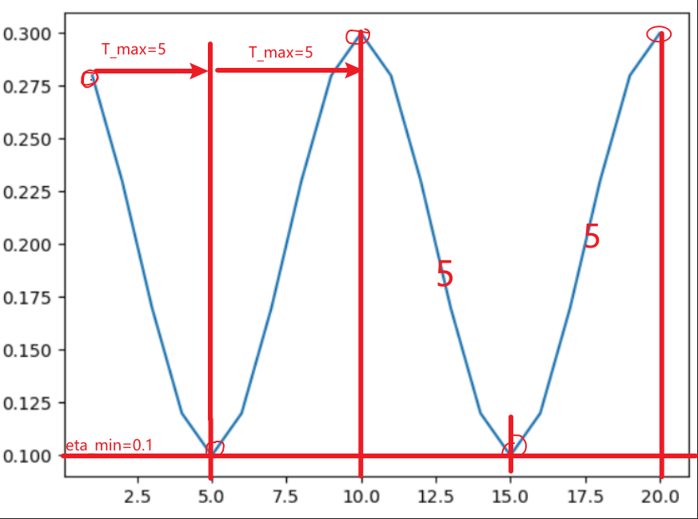
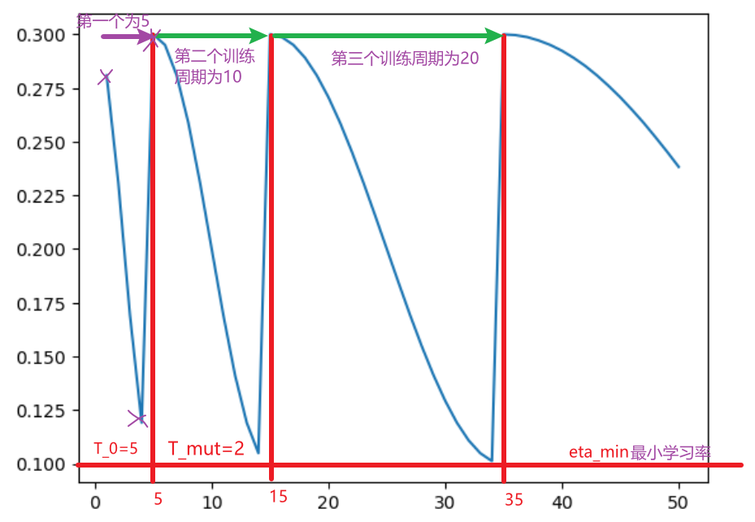
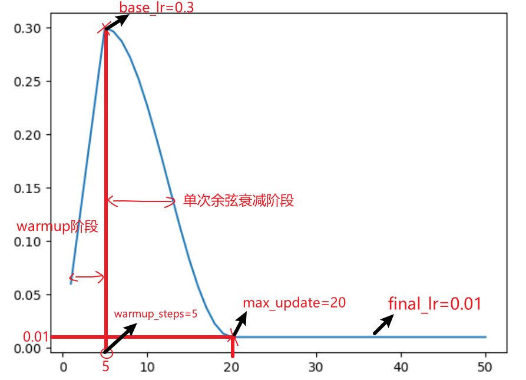

**预热（warmup）：**设置较小的学习率，可以防止发散，但训练慢，可能无法得到最优解；设置较大的学习率，容易发散。因此，在训练初期进行预热，让学习率线性增加到某一固定值，可以缓解上述问题。

**余弦衰减调度器：**若初始设置的学习率较高，则可能一直在最优解附近跳动。因此，学习率衰减可能获得最优解。

# 余弦退火调度器CosineAnnealingLR#

**内置函数用法：**

`CosineAnnealingLR(optimizer=optim, T_max=5, eta_min=lr_min)`

 + eta_min：衰减到最小学习率 
 + T_max：从上一个学习率最大值下降到最小值需要的迭代步数(余弦函数相邻山峰到山谷所需要的迭代次数)

**代码案例：**

导入包

```python
from torch.optim.lr_scheduler import CosineAnnealingLR, CosineAnnealingWarmRestarts,StepLR
from torch.optim import SGD
from torchvision.models import resnet18
import matplotlib.pyplot as plt

model=resnet18(pretrained=False)
```

主程序

```python
base_lr = 0.30
lr_min = 0.10
optim = SGD(model.parameters(), lr=base_lr)
scheduler = CosineAnnealingLR(optimizer=optim, T_max=5, eta_min=lr_min)

lr_list = []
epoch = 20
for i in range(epoch):
    for bath in range(100):
        optim.step()
    scheduler.step()
    temp_lr = optim.param_groups[0]['lr'] # 将优化器optim中的学习率提取出
    lr_list.append(round(temp_lr,2))     # 保留2位小数,便于观察

plt.plot(np.arange(1,epoch+1), lr_list)
print(lr_list)

>>>
[0.28, 0.23, 0.17, 0.12, 0.1, 0.12, 0.17, 0.23, 0.28, 0.3, 0.28, 0.23, 0.17, 0.12, 0.1, 0.12, 0.17, 0.23, 0.28, 0.3]
```

**学习率衰减效果如下：**

<div align='center'>
    
</div>


# 余弦退火调度器CosineAnnealingWarmRestarts#

**内置函数用法：**

`CosineAnnealingWarmRestarts(optimizer=optim, T_0=10,T_mult=1, eta_min=lr_min)`

+ T_0：在第一个周期内(大-小-大)，学习率从最大值减小到最小值再到最大所需要的迭代次数。
+ T_mult：是一个乘法因子，用于调整后续周期的长度。在每个周期结束后，下一个周期的长度将是前一个周期长度的 T_mult 倍。例如，如果 T_0 = 10 并且 T_mult = 2，那么第一个周期的长度为 10 个迭代，第二个周期的长度为 20 个迭代，第三个周期的长度为 40 个迭代，以此类推。
+ eta_min：衰减到最小学习率 。

**代码案例：**

```python
base_lr = 0.3
lr_min = 0.1
optim = SGD(model.parameters(), lr=base_lr)
scheduler = CosineAnnealingWarmRestarts(optimizer=optim, T_0=5, T_mult=2, eta_min=lr_min)

lr_list = []
epoch = 50
for i in range(epoch):
    for bath in range(100):
        optim.step()
    scheduler.step()
    temp_lr = optim.param_groups[0]['lr'] # 将优化器optim中的学习率提取出
    lr_list.append(round(temp_lr,4))

plt.plot(np.arange(1,epoch+1), lr_list)
print(lr_list)

>>>
[0.2809, 0.2309, 0.1691, 0.1191, 0.3, 0.2951, 0.2809, 0.2588, 0.2309, 0.2, 0.1691, 0.1412, 0.1191, 0.1049, 0.3, 0.2988, 0.2951, 0.2891, 0.2809, 0.2707, 0.2588, 0.2454, 0.2309, 0.2156, 0.2, 0.1844, 0.1691, 0.1546, 0.1412, 0.1293, 0.1191, 0.1109, 0.1049, 0.1012, 0.3, 0.2997, 0.2988, 0.2972, 0.2951, 0.2924, 0.2891, 0.2853, 0.2809, 0.276, 0.2707, 0.2649, 0.2588, 0.2522, 0.2454, 0.2383]
```

**学习率衰减效果如下：**

<div align='center'>
    
</div>


# 预热+单余弦调度器#

**代码案例：**

```python
from torch.optim.lr_scheduler import _LRScheduler


class CosineScheduler(_LRScheduler):
    '''一个单词余弦退火+预热'''
    def __init__(self, optimizer, max_update, base_lr=0.01, final_lr=0, warmup_steps=0, warmup_begin_lr=0, last_epoch=-1):
        self.base_lr_orig = base_lr
        self.max_update = max_update
        self.final_lr = final_lr
        self.warmup_steps = warmup_steps
        self.warmup_begin_lr = warmup_begin_lr
        self.max_steps = self.max_update - self.warmup_steps
        super(CosineScheduler, self).__init__(optimizer, last_epoch)

    def get_warmup_lr(self, epoch):
        '''返回当前epoch对应的学习率lr_t=lr0*(epoch_i/warmup_steps)'''
        increase = (self.base_lr_orig - self.warmup_begin_lr) * float(epoch) / float(self.warmup_steps)
        return self.warmup_begin_lr + increase

    def get_lr(self):
        epoch = self.last_epoch
        if epoch < self.warmup_steps:
            return [self.get_warmup_lr(epoch) for _ in self.base_lrs]
        elif epoch <= self.max_update:
            lr = self.final_lr + (self.base_lr_orig - self.final_lr) * (1 + math.cos(math.pi * (epoch - self.warmup_steps) / self.max_steps)) / 2
            return [lr for _ in self.base_lrs]
        else:
            return [self.final_lr for _ in self.base_lrs]

    
epochs = 50
base_lr = 0.3
optim = SGD(model.parameters(), lr=base_lr)
scheduler = CosineScheduler(optim, max_update=20, base_lr=base_lr, final_lr=0.01, warmup_steps=5)

lr_list = []
for i in range(epochs):
    for bath in range(100):
        optim.step()
    scheduler.step()
    temp_lr = optim.param_groups[0]['lr'] # 将优化器optim中的学习率提取出
    lr_list.append(round(temp_lr,4))

plt.plot(np.arange(1,epochs+1), lr_list)
print(lr_list)

>>>
[0.06, 0.12, 0.18, 0.24, 0.3, 0.2968, 0.2875, 0.2723, 0.252, 0.2275, 0.1998, 0.1702, 0.1398, 0.1102, 0.0825, 0.058, 0.0377, 0.0225, 0.0132, 0.01, 0.01, 0.01, 0.01, 0.01, 0.01, 0.01, 0.01, 0.01, 0.01, 0.01, 0.01, 0.01, 0.01, 0.01, 0.01, 0.01, 0.01, 0.01, 0.01, 0.01, 0.01, 0.01, 0.01, 0.01, 0.01, 0.01, 0.01, 0.01, 0.01, 0.01]
```

**学习率衰减效果如下：**

<div align='center'>
    
</div>

**参考：**

[1] 感谢Open AI 的chat GPT 4

[2] [11.11. 学习率调度器 — 动手学深度学习 2.0.0 documentation (d2l.ai)](https://zh.d2l.ai/chapter_optimization/lr-scheduler.html)

[3] [pytorch的余弦退火学习率 - 知乎 (zhihu.com)](https://zhuanlan.zhihu.com/p/261134624)
