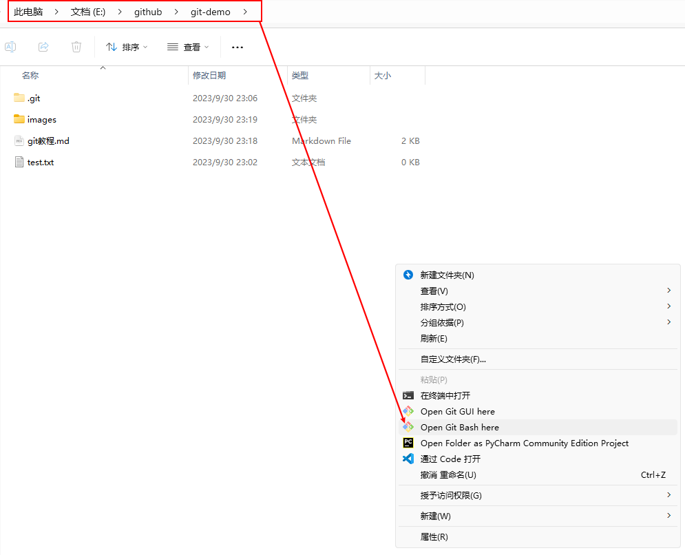
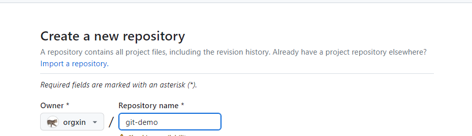
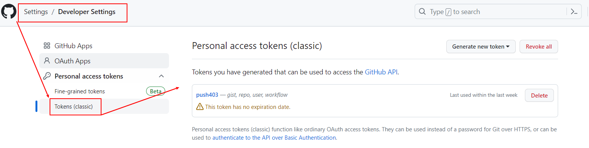
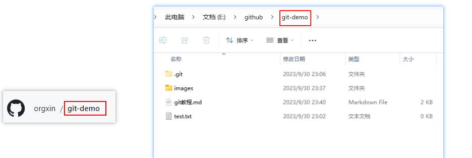
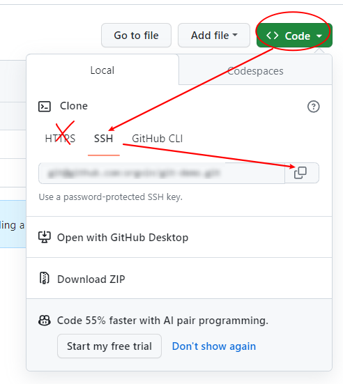
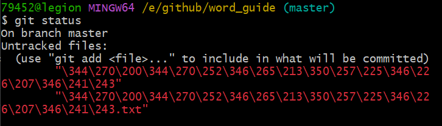
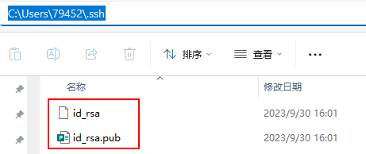
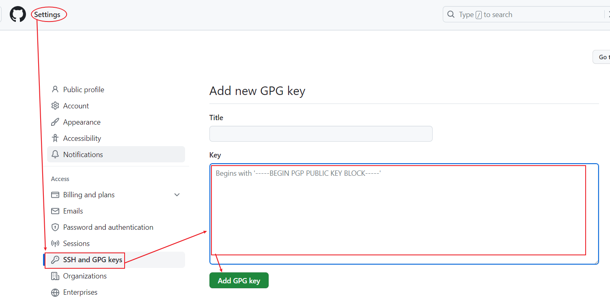

#  使用流程

##  操作流程

* **本地新建一个仓库文件夹git-demo。**

需要在当前路径下打开git bash：

<div align="center"></div>

* **初始化本地仓库。**

```git
79452@legion MINGW64 /e/github/git-demo
$ git init
```

* **在本地编写一个代码用于后面的上传。**
  假设本地仓库新放入一个文件：test.txt。

* **存在暂存区。**

```git
79452@legion MINGW64 /e/github/git-demo (master)
$ git add test.txt
```

* **推送到本地仓库。**

```git
79452@legion MINGW64 /e/github/git-demo (master)
$ git commit -m "first commit" test.txt
```

* **在GitHub新建一个仓库**。
  仓库名设置为`git-demo`，当然自己可以随便命名，建议与我们本地新建的仓库保持一致。获得远程仓库的地址：https://github.com/orgxin/git-demo.git



​	接下来将远程仓库的地址用一个简化的名字代替（别名），便于后期推送，这里我们采用`git-demo`指代https://github.com/orgxin/git-demo.git。

```git
79452@legion MINGW64 /e/github/git-demo (master)
$ git remote add git-demo https://github.com/orgxin/git-demo.git
```
​	以后远程的仓库的链接就可以用别名git-demo代替了。查看远程仓库地址的简化名称:

```git
79452@legion MINGW64 /e/github/git-demo (master)
$ git remote -v
git-demo        https://github.com/orgxin/git-demo.git (fetch)
git-demo        https://github.com/orgxin/git-demo.git (push)
```

* **推送到远程仓库。**

```git
79452@legion MINGW64 /e/github/git-demo (master)
$ git push git-demo master

# 当然，也可以不用别名
$ git push https://github.com/orgxin/git-demo.git master
```
弹框输入账号（你的github名字，不是邮箱账号）和密码(token密码， 不是登录密码)。

关于tokens的获取方法：

<div align="center"></div>

需要把tokens保存到本地（可以长期使用），因为Github上只会显示一次，下次查看就需要重新生成新的tokens。

##  注意事项

（1）远程仓库的命名`git-demo`和本地仓库的命名`git-demo`以及远程仓库链接(https://github.com/orgxin/git-demo.git)的简化名`git-demo`这三者建议都命一样的，也可以设置不一样。



（2）在拉取远程仓库地址时不要使用**HTTPS**地址，建议使用**SSH**远程仓库地址，这样在每次推送的时候不会弹框，让你输入账户名和密码。

<div align="center"></div>

但是在使用**SSH**地址之前还需要做公钥配置，让GitHub可以对你的机子做免密登录，具体配置方法见下文。

#  其他技巧

## 如何拉取远程仓库

如果我们的远程仓库被其他合作者修改过，但是你自己的本地还没有修改过来看，因此需要用到`git pull`命令，将远程仓库修改的内容重新拉到本地仓库。

一般而言，pull和push我们需要反复的用到，在本地修改了之后就要push到远程进行同步。在远程仓库的文件被其他合作者修改之后，就需要pull下来对本地的进行替换。

```git
79452@legion MINGW64 /e/github/git-demo (master)
$ git pull git-demo master
```
## TOC目录对GitHub失效

* vscode中安装`Markdown All in One`插件；
* 在.md界面键入`Ctrl+Shift+P`快捷键，然后输入`Markdown All in One: Create Table of Contents`即可自动生成目录。

## git对中文乱码问题

如图，如果路径中有中文命名的文件需要存到仓库，采用`git add`就会显示中文乱码的问题。

<div align="center">

</div>

**解决办法：**

```git
$ git config --global core.quotepath false
$ git config --global gui.encoding utf-8
$ git config --global i18n.commit.encoding utf-8
$ git config --global i18n.logoutputencoding utf-8
$ set LESSCHARSET=utf-8
```

## 配置ssh免密登录

* 输入`$ ssh-keygen -t rsa`，敲三次回车键自动生成密钥，在本地生成如下两个文件：

<div align="center">

</div>


* 将`id_rsa.pub`里面的内容复制到github中。

<div align="center">

</div>

* 验证是否绑定成功：`$ ssh -T git@github.com`
  出现“You've successfully authenticated...”表示绑定成功。
  

## 更改git用户名和邮箱

为了便于身份的识别，需要给每台设备的git取一个名字和邮箱，这个用户名和邮箱可以任意取（不是Github的用户名和邮箱）。

* 查看用户名和邮箱
```git
79452@legion MINGW64 /f/NewDesktop
$ git config user.name

79452@legion MINGW64 /f/NewDesktop
$ git config user.email
```

* 配置全局用户名和邮箱
```git
79452@legion MINGW64 /f/NewDesktop
$ git config --global user.name home

79452@legion MINGW64 /f/NewDesktop
$ git config --global user.email 794529766@qq.com
```
* 查看用配置信息
```git
79452@legion MINGW64 /f/NewDesktop
$ git config --global --list
```

# 常用操作命令

## git add命令

git add作用是把文件放在暂存区，具体原理这里不深究。但是git add有很多命令，如`git add .`、`git add *`、`git add -A`、`git add -u`、`git add your_file`，就一个add把人给整晕了。

* 如果仅改动某一个文件，则直接用`git add file`指定即可。
* 若改动的文件比较多，还包括文件夹，则可以使用`git add *`或者`git add .`，可以将所有改动包括删除的文件都放在暂存区。区别就是`git add *`不考虑`.xxx_folder`这种文件夹。
* `git add -A`不受当前所在路径限制，将整个工作区的修改、新增和删除都放在暂存区。

## git bash命令

* `cd`: 切换路径。
* `pwd`: 显示当前路径。
* `ls`: 展示当前路径中所有文件和文件夹（不包括.git文件夹）。
* `ll`: 展示当前路径中更加详细的文件和文件夹信息，推荐使用简单版的`ls`。
* `touch xxx.yy`: 新建一个名为xxx，后缀为yy的**文件**。
* `rm xxx.yy`: 删除xxx.yy**文件**。
* `mkdir xxx`: 新建xxx**文件夹**。
* `rm -r xxx`: 删除xxx**文件夹**。
* `git log`: 查看提交的历史记录。（详细版）
* `git reflog`: 查看提交的历史记录。（简易版）推荐
* `git status`：查看文件的状态命令

# 参考文献

[1] https://blog.csdn.net/qq_35246620/category_9268436.html

[2] [git add .，git add -A，git add -u，git add * 的区别与联系 - 掘金 (juejin.cn)](https://juejin.cn/post/7053831273277554696)

[3] [01_尚硅谷_Git_课程介绍_哔哩哔哩_bilibili](https://www.bilibili.com/video/BV1vy4y1s7k6/?p=1&vd_source=9846a548f75285e1389fa28ee637d374)